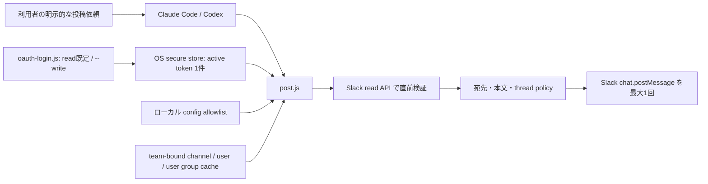
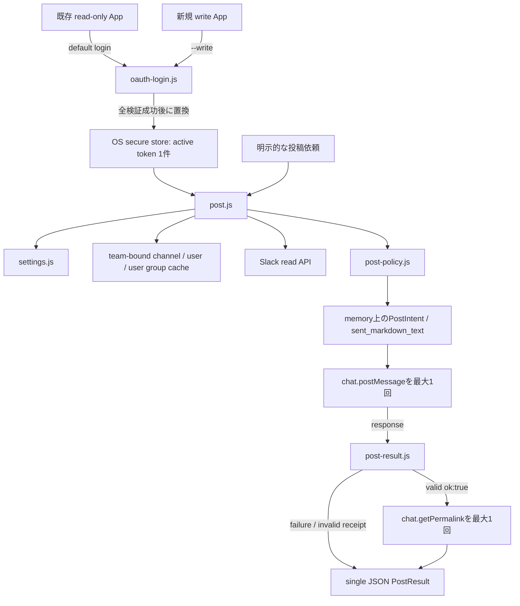

# Slack メッセージ投稿機能 設計・実装計画

## 文書の位置づけ

- 対象: `plugins/slack`
- 起点: Issue #24 の利用課題を、現行 `main` と Slack の公式仕様から再設計する
- 状態: grilling確認済み・実装待ち
- この文書では実装しない。計画が承認された後、フェーズ順に実装する
- PR #23 は要件理解の参考に限り、差分をそのまま取り込む前提にはしない

## 概要

Slack から取得・集約した情報を、利用者がコピーせずに Slack へ戻せるようにする。
ただし投稿は外部副作用であり、Slack 以外から取得した情報を意図しない相手へ流出させる経路にもなる。
そのため、初回リリースでは投稿可能範囲を次の積集合に限定する。

1. 既存の読み取りチャンネルキャッシュに存在する public チャンネル ID
2. ローカル設定で投稿を明示許可したチャンネル ID
3. Slack Connect や Enterprise 内共有ではない社内チャンネル

参加条件は、現行の user token に付与する `chat:write` と Slack の `chat.postMessage` が強制する。
未参加チャンネルへ投稿すると Slack API は `not_in_channel` を返す。未参加 public チャンネルへの
投稿を可能にする bot token 専用の `chat:write.public` は要求しない。plugin が `is_member` を見る場合も、
権限境界ではなく投稿前に失敗を早く知らせるための補助検証として扱う。

既存の読み取り専用 Slack App は変更せず、通常の `slack-auth login` はこの App で認証する。
投稿を使う利用者だけが `slack-auth login --write` を明示し、read scope に `chat:write` を
加えた別のwrite Appで認証する。二つのtokenを同時保存せず、OS secure storeの単一slotに
現在選択中のcredentialだけを保存する。再ログインでは新tokenのscope・workspace・user検証が
すべて成功した後にだけ既存recordを置き換え、認証失敗時は直前のcredentialを維持する。

`chat:write` は投稿先の種別を制限する scope ではなく、public、private、DM、MPIM への
`chat.postMessage` に共通して使われる。また投稿専用の scope でもなく、`chat.update` と
`chat.delete` も同じ scope を利用する。したがって、DM禁止と編集・削除非対応はscopeではなく、
投稿先候補の限定、live属性検証、未実装APIを公開しないことによってplugin側で強制する。

初回リリースでは、人間による追加承認機能を実装しない。利用者が `/slack-post` または自然言語で
投稿を明示依頼したことを、その投稿操作の依頼として扱い、policy 検証後に一回だけ送信する。
preview と send の二段階実行、`--confirm`、approval receipt、スクリプト途中の対話入力、
Codex Rules、Claude Code hooks、MCP tool approval は投稿の前提や安全境界にしない。

投稿成功後は、Slack が返した channel ID と timestamp から `chat.getPermalink` を呼び、
workspace ID、channel ID、timestamp、permalink、実際に送信した本文を利用者へ返す。
誤りに気づいた利用者が対象メッセージをすぐ開き、
workspace / organization policy で許可される範囲で Slack UI から編集または削除できる導線を設ける。
plugin 自身には `chat.update` / `chat.delete` の API、entrypoint、skill を追加しない。

初回リリースでは private チャンネル、DM、グループ DM、Slack Connect、予約投稿、編集、削除、
ファイル、Block Kit、attachments、broadcast reply を扱わない。本文は利用者が明示した完成済みの
単一`markdown_text`だけをstdinから受け取り、skill自身は本文を生成・要約・補完しない。user / user group / broadcast
mentionは許可するが、名前からの変換はworkspaceに結び付いたcacheとlive情報で一意に検証し、通知到達は保証しない。

## 主要な設計判断

| 項目 | 決定 | 理由 |
|---|---|---|
| token 種別 | 現行どおり user token | 現在の検索・読み取り・PKCE・token rotation と同じ認証モデルを維持し、変更範囲を限定する |
| Slack App | 既存の読み取り専用 App と、新規のwrite Appを分離する | 同一Appの再認証ではscopeが加算され、通常loginへ戻しても`chat:write`をdowngradeできないため |
| login既定値 | `slack-auth login`は読み取り専用App、`--write`指定時だけwrite App | 書き込み権限の取得を明示的なopt-inにし、通常loginから書き込みscopeを取得しない |
| 投稿 scope | write Appだけがread scopes + `chat:write`を要求する | 投稿不要の利用者と既存Appへ書き込み権限を付与しない |
| token保存 | OS secure storeの既存単一slotを維持し、認証成功後にactive credentialを置換する | 二tokenのstatus・refresh・選択管理を増やさず、現在の権限状態を一意にする |
| 投稿先候補 | 既存の読み取りチャンネルキャッシュに存在する public チャンネル ID | 読み取り対象外の ID を投稿機能から新たに探索・指定できないようにする |
| 投稿先 | 候補のうち、設定で明示許可された社内・public チャンネルのみ | 読み取りキャッシュと書き込み allowlist の積集合で宛先を二段階に限定する |
| 参加条件 | user token の `chat:write` による Slack 側の強制 | 未参加時は `not_in_channel` になり、`chat:write.public` は bot token 専用かつ非採用。`is_member` は fail-fast 用に限る |
| private チャンネル | 初回版では非対応 | privateの基本属性・共有状態をlive検証するには`groups:read`が必要で、現在の読み取り範囲を広げるため |
| DM / MPIM | 投稿先候補とlive属性検証の両方で拒否 | `chat:write`自体はDM/MPIM投稿を禁止せず、`im:*` / `mpim:*`を持たないことも投稿禁止の代わりにはならないため |
| Slack Connect | external / pending / shared を初回版では拒否 | private/public に関係なく外部 organization へ情報が届き得るため |
| workspace | 初回版のposting設定は一つのteam IDだけに固定 | 単一active token、cache、channel allowlistをworkspace横断で混同しないため |
| 投稿許可リスト | `allowed_post_channel_ids`。既定は空 | scope だけでなく plugin 側でも送信先を限定し、導入直後の投稿を無効にする |
| 人の承認 | 初回版では実装しない | skill、対話 stdin、Codex Rules、Claude hooks は全 surface で人間承認を強制する共通境界にならず、receipt を加えても agent 自身が操作できるため |
| 投稿実行 | 単一 entrypoint で検証後に一回だけ送信 | 二段階状態・短命receipt・再入力をなくし、失敗状態と再送禁止を単純に保つ |
| 投稿後のリカバリー | workspace ID、channel ID、timestamp、permalink、実際に送信した本文を返し、Slack UIでの確認・編集・削除を案内する | 送信先と送信内容を利用者が照合でき、AIへ編集・削除操作を追加せず人が訂正できるようにする |
| 本文入力 | CLI 引数ではなく stdin | process list と shell history への本文露出を減らすため |
| 投稿形式 | 単一`markdown_text`、変換後12,000 Unicode code points以下 | Markdownを利用し、Block Kitなど別形式の入力と長文の自動分割・切り詰めを避ける |
| メンション | user / user group / broadcastを許可し、名前指定はcode外の型付き記法だけをcacheから変換する | 名前の誤解釈を避けつつ、Slack標準記法と明示された通知を利用可能にする |
| link unfurl | 常に無効 | Slackによるlink previewの取得・展開を抑止するため |
| retry | 投稿 API の自動 retry はしない | timeout や接続切断時の二重投稿を防ぐため |
| 削除・編集 | API、entrypoint、skill を実装しない | `chat:write` は `chat.update` / `chat.delete` にも使われ、投稿だけに限定する別scopeはない。pluginの公開機能を投稿だけに限定し、投稿後に返すpermalinkから Slack UI で人が行う |

## 背景と現状

現行 Slack plugin は次の境界を持つ。

- 既存の読み取り専用Appからuser tokenをOAuth PKCEで取得し、OS secure storeの単一slotに保存する
- workspace allowlist と guest user 拒否を token 保存前に検証する
- `channels:read` / `channels:history` により public チャンネルだけを読み取る
- `search:read.public` により public チャンネルだけを検索する
- チャンネルキャッシュは `conversations.list(types=public_channel)` 由来の `{name: id}` で、投稿先候補の public チャンネル ID を提供する。ただし stale 化し得るため、現在の種別や共有状態は保証しない
- JSON POST helper は存在するが、投稿機能は公開していない
- 実 API smoke は読み取りだけを対象にしている

上記は`main`と既存read-only Appの基準状態である。現在のworking treeには、過去の検証で
`slack-app-manifest.json`と`oauth-login.js`が`chat:write`を常時要求する未コミット差分が残っている。
同じ差分で`DEFAULT_CLIENT_ID`も`main`の`6381386946.11798351065735`から
`6381386946.11807045760195`へ変更され、manifest表示名も`main`の`Claude Slack Reader`から変更されている。
これはread/write分離の完成形ではないため、Phase 1でユーザーの差分を無断破棄せず内容を確認したうえで、
remoteの既存Appと二つのClient IDの対応を確認し、既存manifest / default loginをread profileへ戻して、
working tree側の新Client IDがwrite Appと確認できた場合だけ`DEFAULT_WRITE_CLIENT_ID`へ移す。

投稿機能を加えると、誤爆だけでなく、Google Drive、ローカルファイル、他ツールから取得した内容を
Slack へ流出させる新しい経路が生まれる。これは Slack scope だけでは防げない。

### Issue #24 / PR #23 の確認結果

- Issue #24 の利用課題と、`chat:write.public` を要求しない方針は妥当である。
- PR #23 は App manifest に `chat:write` を追加しているが、`oauth-login.js` の authorize URL と
  granted scope 検証には追加していない。そのため、PRのまま再認証しても投稿可能なuser tokenを
  取得できず、`chat.postMessage`は`missing_scope`になる。
- PR #23のように既存Appへ`chat:write`を足す方式は採用しない。読み取り専用Appを維持し、
  write Appを別に作成して、login optionでどちらのAppを使うか明示的に選択する。
- PR #23 のprivate投稿経路は、ID指定後に`conversations.info`で`is_im`、`is_mpim`、`is_member`を
  確認する。しかしprivate conversationの情報取得に必要な`groups:read`を要求していないため、
  private channelではpreflightが失敗し、fail closedで投稿に到達しない。
- したがってPR #23のprivate投稿は、policy関数とunit test上の意図に留まり、実際に成立する機能ではない。
  PR本文でも実投稿は未検証とされている。
- 名前指定時の`is_member`事前確認漏れは、user tokenと`chat:write`によるSlack側の
  `not_in_channel`拒否があるため権限逸脱にはならない。ただし「pluginが参加済みを事前確認する」
  というPR自身の説明とは一致しない。
- 本計画はprivate対応のために`groups:read`を追加せず、既存public cacheと投稿allowlistの積集合に
  初回版を限定する。private投稿は読み取り範囲拡大を伴う独立計画として再評価する。

### 参加条件の責務分担

- 今回の実装が使うuser tokenでは、`chat:write`だけを付与しても未参加チャンネルへは投稿できず、
  Slackが`not_in_channel`で拒否する。これは投稿可否を決めるprovider側の権限境界である。
- 未参加publicチャンネルへ投稿範囲を広げる`chat:write.public`はbot token専用であり、現行の
  user tokenへ付与できない。本pluginはbot tokenへ移行せず、`chat:write.public`も要求しない。
- pluginによる`is_member`確認はSlack側の権限境界を置き換えない。`is_member === false`が取得できた
  場合に、投稿APIを呼ぶ前に分かりやすく失敗させるfail-fastとしてのみ使う。
- `is_member`が欠けていても「参加済み」と推測しない一方、それだけでsecurity-critical属性の欠落とは
  扱わない。ほかの宛先policyを満たした場合はSlackの最終判定へ進み、`not_in_channel`を確定失敗として
  扱って自動retryしない。
- したがって、PR #23の名前指定経路に`is_member`事前確認がない点は権限逸脱ではない。
  stale cacheにより投稿可能と誤って案内してからSlackで失敗し得る、という事前検証と説明の不一致である。
  本計画では修正対象に含めるが、セキュリティ上のblockerとは分類しない。

## 目標

### 機能目標

- 読み取りチャンネルキャッシュと allowlist の両方に登録された public チャンネルへ、テキストを投稿できる
- public チャンネル内の既存スレッドへ返信できる
- workspace、投稿者、宛先、チャンネル属性、本文、thread を一つの処理内で検証してから投稿できる
- 一つの実行につき `chat.postMessage` を最大一回だけ呼び、自動再送しない
- 投稿成功後に workspace ID、channel ID、timestamp、permalink、実際に送信した本文を返し、対象メッセージをSlack UIですぐ開ける
- 通常loginと既存credentialは読み取り専用のまま維持し、投稿時だけ`--write`での再認証を案内できる

### セキュリティ目標

- DM、グループ DM、private、未許可、archived、frozen、read-only、shared channel へ投稿しない
- DM / MPIM禁止はSlack scopeの効果と誤認せず、読み取りcache由来の候補集合とlive属性検証で強制する
- 読み取り専用Appとwrite Appを分離し、通常loginから`chat:write`を取得しない
- active token recordのprofileと実際のgranted scopeが一致しない場合はfail closedにする
- 未参加チャンネルへの投稿は user token の `chat:write` によって Slack 側で拒否され、`chat:write.public` を追加しない
- channel cache、allowlist、live channel属性のすべてを宛先判定に使い、cache単独、ID prefix、エージェントの判断だけを許可根拠にしない
- token、refresh token、Authorization header、Slack response全体を出力しない
- 本文を一時file、shell argument、環境変数へ保存せず、本文validationを通過して投稿を試みた場合だけ
  実際の送信本文を構造化resultへ含める。不正UTF-8 byte列・禁止code pointによる拒否ではraw本文を再出力しない
- mentionの名前変換をworkspaceに結び付いたcacheとlive情報で検証し、`link_names`、link unfurl、reply broadcastを使わない
- ambiguous failure から自動再送しない

### 運用目標

- 既存の読み取り専用App、install、credentialを変更せずに継続利用できる
- App管理者によるwrite Appの作成・installと、利用者の`--write`再認証を明確に分離する
- default loginで読み取り専用へ戻せるようにし、現在のprofileを`slack-auth status`で確認できる
- 実投稿テストは専用チャンネルと無害な本文に限定し、返されたpermalinkからSlack UIで投稿を確認・削除する
- plugin 更新、認証、allowlist 設定、投稿の導線を README / SETUP / skill で一致させる

## 非目標

初回リリースでは以下を実装しない。

- private チャンネルへの投稿
- DM / グループ DM / App Home への投稿
- Slack Connect または外部共有が pending のチャンネルへの投稿
- Enterprise 内共有チャンネルへの投稿
- 未参加 public チャンネルへの投稿
- `chat:write.public`、`groups:read`、`groups:history`、`im:*`、`mpim:*` の追加
- `chat.update`、`chat.delete`、`chat.scheduleMessage`
- files、snippets、blocks、attachments、metadata
- `reply_broadcast`
- 人間による投稿前承認、preview / send の二段階フロー、approval receipt
- スクリプト途中の `y/N` などの対話入力
- Codex Rules、Claude Code hooks、MCP tool approval への依存
- 自動投稿、無人定期投稿、投稿失敗時の自動 retry
- read tokenとwrite tokenの同時保存・自動切替
- `slack-auth clear`によるSlack側tokenのrevoke
- 本文の出所制限、DLP、機密度判定、内容審査
- mention通知が各対象へ実際に到達したことの保証
- `#channel-name`の自動link化
- 投稿済みmessageの永続dedupe
- 同じ OS account または Slack token を完全に奪取した攻撃者への防御

外部automationから投稿scriptを直接起動することを技術的に防ぐ機能は初回版に含めない。
ただしplugin自身にはschedulerや無人投稿triggerを追加せず、skillは明示的な投稿依頼にだけ反応する。

private チャンネル投稿が必要になった場合は、`groups:read` による読み取り範囲拡大、
Slack Connect 判定、private thread 検証に必要な scope を独立した計画で再評価する。
その計画では `users.conversations(types=public_channel,private_channel)` から認証ユーザーの
参加済み候補を作り、`im` / `mpim` を取得対象に含めない方式を第一候補とする。ただしmembershipの
最終強制は引き続きSlack側に置き、plugin側の候補化はfail-fastとDM/MPIM除外のために使う。

## 公式仕様から確認した前提

1. `chat:write` は user token と bot token の両方で `chat.postMessage` に利用できる。
2. `chat:write` は `chat.postMessage` だけでなく `chat.update` と `chat.delete` にも利用される。
   投稿だけに限定する別scopeはないため、編集・削除非対応はpluginの実装境界として強制する。
3. `chat.postMessage` は public、private、DM、MPIM を同じ API で扱う。`im:*` / `mpim:*`を
   要求しないことは会話の探索・情報取得を制限するが、`chat:write`による既知IDへの投稿禁止にはならない。
4. 現行の user token で `chat:write` を使う場合、未参加チャンネルへの投稿は `not_in_channel` で拒否される。未参加 public チャンネルへ投稿できる `chat:write.public` は bot token 専用であり、本pluginでは要求しない。
5. `conversations.info` が返すfieldはconversation種別とcontextによって異なり、通常のpublic channelでも
   `is_ext_ws_shared`、`is_read_only`、`is_thread_only`、`is_non_threadable`などが省略され得る。
   宛先の種別・共有境界を確定する必須fieldと、Slackの投稿APIが最終強制する書き込み制約fieldを分ける。
   ID prefixで種別を推定せず、`is_member`は権限境界ではなく、明示されていれば投稿前のfail-fastにだけ利用する。
6. private チャンネルの情報取得には `groups:read` が必要である。
7. `is_ext_shared` は外部 organization と共有されたチャンネルを示す。private チャンネルでも外部共有され得る。
8. 同じSlack App・userのOAuth scopeは再認証のたびに加算され、通常の再認証ではdowngradeできない。
   scopeを除去するにはtokenをrevokeする必要があるため、read/writeの切替に同一Appを使わない。
9. Slackはoptional OAuth scopeを提供するが、今回の権限分離はoptional scopeではなく別Appで行う。
10. 既存の読み取り専用Appは変更しない。write Appは別のClient IDとmanifestを持ち、App管理者が
    workspaceへinstallした後、利用者が`--write`で認証する。
11. `chat.postMessage`の`markdown_text`はMarkdownを受け付け、`text`や`blocks`とは併用できず、
    公式上限は12,000 charactersである。Slackはcharacterの数え方を明記していないため、
    本pluginは暫定的な製品仕様としてUnicode code point数を12,000以下に制限し、超過時に分割・切り詰めない。
12. Slackのmention記法の公式説明は主に`text` / mrkdwn向けで、`markdown_text`との組み合わせは明記されていない。
    本計画のmention挙動は実workspaceで確認済みの範囲と追加smokeで固定し、`link_names`には依存しない。
13. link unfurl は既定で有効なため、`unfurl_links: false` と `unfurl_media: false` を明示して
    Slackのlink preview展開を抑止する。URLの表示・clickabilityや全network処理の停止までは保証しない。
14. `chat.postMessage` の応答本文は Slack 側で正規化され、入力と完全一致しない場合がある。
15. `chat.getPermalink` は追加scopeを要求せず、channel IDとmessage timestampから、threadを含む
    対象メッセージのpermalinkを返す。
16. 今回のuser tokenによる投稿は認証ユーザー本人の投稿として扱われる。本人はSlack UIから自分の
    投稿を編集・削除できるが、可否と編集可能時間はworkspace / organization policyに従う。

### grilling中の実workspace確認

- `markdown_text`でMarkdown、code外のraw user mention、code内の同記法、URLを投稿し、responseの
  rich textでuser要素、code literal、link要素へ分かれることを確認した。unfurlは無効だった。
- `markdown_text` + `link_names: true`では平文`@here`が期待したbroadcast要素にならず、`link_names`を採用しない根拠とした。
- `markdown_text`でcode外に明示`<!here>`、code内に同じ文字列を置くと、responseのrich textでは
  code外だけがbroadcast要素になった。これを平文broadcastの明示記法変換の根拠とする。
- raw user group mention、12,000 characters周辺のastral / combining文字、実通知到達は未検証であり、
  unit testと実装後smokeを分けて記録する。notification deliveryは完了条件にしない。

## 脅威モデル

### 保護対象

- Slack access token / refresh token
- 投稿本文に含まれる社内情報・個人情報・秘密情報
- 投稿先と実際の閲覧者範囲
- policy 検証済みの宛先・本文・thread の組み合わせ
- Slack 上の投稿副作用と、単一実行内の重複防止
- 単一posting workspace allowlistと認証user identityの境界

### 信頼境界



### 想定する失敗・攻撃

- prompt injection や外部入力が投稿先・本文・mention をすり替える
- stale cache が古い channel ID を候補として残す、または新しい読み取りチャンネルを候補に含めない
- live検証と `chat.postMessage` の間に channel が rename、共有化、archive、membership 変更される
- typed mentionが曖昧な名前や別workspaceのcacheを誤解決する
- code内の`@here`などを誤変換し、意図しない通知を発生させる
- URL unfurlにより意図しないlink previewの取得・展開が発生する
- reply の timestamp が別 channel、reply 自身、存在しない message を指す
- timeout 後に retry して同じ内容を二重投稿する
- login profileとClient IDまたはgranted scopeが食い違い、想定外の権限を持つtokenが保存される
- 投稿対応tokenへの切替に失敗した途中で、利用可能だった読み取りtokenまで失う
- token や本文が process list、エラー、test logへ出る

### 残余リスク

- 初回版は投稿直前の人間確認を行わない。skill の発火条件は運用契約であり、prompt injection や
  agent の誤判断に対する技術的な承認境界ではない。
- cache・allowlist・public/internal限定は宛先を狭めるが、本文の機密性を判定しない。許可チャンネルへ
  Slack以外から取得した情報を投稿する流出経路は残る。
- mentionを含むmessageをSlackが受理しても、対象userの状態、通知設定、channel membershipなどにより
  通知が実際に届くとは限らない。pluginのsuccessは通知到達を意味しない。
- スクリプト内の対話入力はagent自身がstdinへ回答でき、非対話surfaceでは停止し得るため採用しない。
- Codex Rulesはサンドボックス外コマンドに対するhost設定であり、Full AccessやAuto-reviewなどの設定差がある。
  Claude Codeのpermission/hookも別契約であるため、どちらもplugin共通の人間承認保証として扱わない。
- user token を持つ同じ OS account の攻撃者は plugin を通さず Slack API を直接呼べる。
- write profileがactiveな間は、読み取り処理も`chat:write`を持つ同じtokenを利用する。二tokenを
  同時管理しない単純さとのtrade-offとして受け入れ、不要になれば通常loginでread profileへ戻す。
- `slack-auth clear`と通常loginはローカルのactive credentialを削除・置換するだけで、Slack側で
  発行済みtokenをrevokeしない。token漏えい時の無効化はApp管理者によるrevoke / uninstallで行う。
- live検証と投稿API呼び出しの間には短いTOCTOUが残り、Slack側の最終判定に依存する。
- ambiguous failure後に利用者やagentが新しい投稿依頼を行うと重複し得る。pluginは自動retryせず、
  Slack UIで投稿有無を確認するよう案内する。
- 投稿成功後でも `chat.getPermalink` だけが失敗する可能性がある。この場合は投稿成功を失敗へ
  巻き戻さず、workspace ID、channel ID、timestamp、実際に送信した本文を返してpermalink取得失敗を明示し、
  投稿を再実行しない。
- permalinkは訂正までの時間を短縮するが、投稿を既に閲覧・通知された事実や、保持policyにより
  保存された編集・削除履歴までは取り消せない。

## 機能要件

### FR-1: OAuth scope

- read profileとwrite profileのscope集合をコード上の一か所で定義する。
- read profile:
  - `channels:history`
  - `channels:read`
  - `search:read.public`
  - `users:read`
  - `usergroups:read`
- write profileはread profileの全scopeに`chat:write`を加えた集合とする。
- `plugins/slack/slack-app-manifest.json`は既存の読み取り専用Appを表し、read profileのscopeだけを持つ。
- `plugins/slack/slack-write-app-manifest.json`を新設し、write profileのscopeを持つ。
- どちらのmanifestにも`user_optional`を使わない。read Appの表示名はPhase 0でremote既存Appと照合して維持し、
  write Appは`(Write)`など明確に異なる表示名としてSlackの認可画面でも権限差を識別できるようにする。
- `slack-auth login`は既定でread profileと既存の読み取り専用App Client IDを選ぶ。
- `slack-auth login --write`だけがwrite profileとwrite App Client IDを選ぶ。
- read profileのClient ID優先順位は`--client-id`、`SLACK_CLIENT_ID`、configの`client_id`、
  既存`DEFAULT_CLIENT_ID`とする。
- write profileのClient ID優先順位は`--client-id`、`SLACK_WRITE_CLIENT_ID`、configの
  `write_client_id`、新規`DEFAULT_WRITE_CLIENT_ID`とし、read側の設定を暗黙に流用しない。
- remote照合で確認した`main`のread Client IDを`DEFAULT_CLIENT_ID`、working treeの新Client IDを
  `DEFAULT_WRITE_CLIENT_ID`へ割り当て、二定数が異なることをcontract testで固定する。
- token response と保存recordは、選択profileのscope不足、余分なscope、scope field欠落をfail closedで拒否する。
- read profileで`chat:write`が返った場合は保存せず、読み取り専用App設定またはClient IDの不一致として扱う。
- write profileで`chat:write`が欠ける場合は保存せず、write AppのinstallまたはClient IDを確認するよう案内する。
- provider response に scope がなければ期待値を補完して保存しない。
- token recordへ`auth_profile: "read" | "write"`、選択した`client_id`、実際のgranted scopeを保存する。
- OS secure storeは既存の単一slotを維持し、read/write tokenを同時保存しない。
- OAuth code交換、scope、workspace、userの全検証が成功してからactive recordを一回だけ置換する。
  login失敗時は既存recordを削除・上書きしないため、切替前のcredentialを継続利用できる。
- token recordは`version: 1`かつ`auth_profile`なし・read scope完全一致の場合だけlegacy readとして互換利用する。
  `version: 2`は`auth_profile`とprofile別scope完全一致を必須とする。version欠落・型不正・未知future version、
  v1にprofileあり、v2にprofileなし、`chat:write`や未知scopeを持つlegacy recordは推測せず再認証を要求する。
- refresh後もrecordのprofileを維持し、返されたscopeを同じprofile policyで再検証する。
- `slack-auth status`はactive profile、read/post capability、Client ID、実scopeをtoken値なしで表示する。
- post実行直前に`auth_profile === "write"`とwrite profileのgranted scopeを再確認する。
- `slack-auth clear`はactive recordをローカルから削除するだけでSlack側tokenをrevokeしないことを明示する。
- profile切替のために事前の`clear`を要求せず、通常loginでreadへ、`--write`でwriteへ置換できるようにする。

### FR-2: 投稿先 allowlist

- `~/.config/scoped-connectors/slack/config.json`に`allowed_post_team_id`を追加し、posting対象workspaceを
  一つのSlack team IDへ固定する。値は既存`allowed_team_ids`にも含まれなければならない。
- `~/.config/scoped-connectors/slack/config.json` に `allowed_post_channel_ids` を追加する。
- 値は Slack channel ID の配列とし、名前は保存しない。
- `allowed_post_team_id`未設定または`allowed_post_channel_ids`が空の場合は投稿機能を無効にする。
- 空文字、重複、不正形式、文字列以外を拒否する。
- 投稿処理で、各 ID が既存の読み取りチャンネルキャッシュにも存在することを要求する。
- active token、`allowed_post_team_id`、各posting cacheのteam IDを完全一致させる。
- allowlist に存在しても読み取りチャンネルキャッシュに存在しない ID は、private / DM を含む任意 ID 指定への抜け道にせず拒否する。
- cache がない、壊れている、対象 ID がない場合は投稿せず、`/slack-channels` でcacheを更新してから再試行するよう案内する。
- 既存 config を上書きさせないよう、SETUP に保存先・権限・統合 JSON 例をまとめて掲載する。
- channel ID は `/slack-channels` の出力から選び、出力にない ID を設定へ直接追加する導線は案内しない。
- postingで使うchannel cacheはschema version、team ID、生成日時を必須とし、active tokenのteam IDと一致させる。
  metadataのない旧cacheは既存read commandでは互換利用できるが、postingでは拒否して`/slack-channels`を案内する。
- cacheに固定TTLは設けず、schema / team不一致、破損、live属性との不一致をstaleとして扱う。
- posting処理からcacheを自動更新せず、更新は明示的な`/slack-channels`に限定する。

### FR-3: 宛先解決と live 検証

- top-level投稿の入力は channel name、ID、Slack channel URLを受け付ける。
- name は既存の読み取りチャンネルキャッシュで ID へ解決する。
- channel URLはIDを抽出するだけで許可根拠にはせず、name / IDと同じcache・allowlist・live検証を適用する。
- channel URLはusername / password / port / query / fragmentを持たないHTTPS URLで、hostが`slack.com`または
  `.slack.com`で終わり、pathが`/archives/{channelId}`または末尾slash付きの完全一致である場合だけ受け付ける。
  `{channelId}`は`^[A-Z][A-Z0-9]{1,63}$`に一致させる。`/p...` message segment、`thread_ts`、追加pathを持つ
  message URLは`--channel`で拒否し、IDだけ抽出してtop-level投稿へ変換しない。
- URLらしい入力がchannel URL grammarに一致しない場合は、channel nameとしてfallbackせず拒否する。
  host名やURL文字列からworkspace authorizationを推測しない。
- ID 直指定も、同じcacheのvalueに存在する場合だけ投稿先候補として受け付ける。
- cache と `allowed_post_channel_ids` の積集合に入らない宛先は、Slack APIへ問い合わせる前に拒否する。
- cache は候補集合の境界として使うが、stale 化し得るため現在のチャンネル属性の根拠にはしない。
- ID 解決後、`chat.postMessage` の直前に `conversations.info` を呼ぶ。
- 次をすべて満たす場合だけ許可する。
  - ID が読み取りチャンネルキャッシュにある
  - ID が `allowed_post_channel_ids` にある
  - `is_channel === true`
  - `is_private === false`
  - `is_im === false`
  - `is_mpim === false`
  - `is_archived === false`
  - `is_frozen === false`
  - `is_shared === false`
  - `is_ext_shared === false`
  - `is_pending_ext_shared === false`
  - `is_org_shared === false`
- 上記の種別・共有境界を確定する必須booleanが欠ける、boolean以外である、または安全値と厳密一致しない場合は拒否する。
- `is_ext_ws_shared`は明示的な`true`なら拒否する。欠落時は、`is_shared`、`is_ext_shared`、
  `is_pending_ext_shared`、`is_org_shared`がすべて厳密に`false`である場合だけ非共有判定を維持する。
- `is_read_only`は明示的な`true`なら投稿前に拒否する。欠落時は書き込み可能と推測せず、
  `chat.postMessage`の`restricted_action_read_only_channel`を最終判定とする。
- 欠落を許容するfieldでも、値が存在する場合にboolean以外ならresponse解釈不能として拒否する。
- `is_member === false` が明示された場合は、`chat.postMessage`を呼ばずに拒否する。
- `is_member` が欠けている場合は権限を推測せず、`chat.postMessage`を最終判定とする。`not_in_channel`は安全な確定失敗として扱い、自動retryしない。
- `D` / `G` / `C` prefix だけで許可判断しない。

### FR-4: 本文とmention

- skillは利用者が明示した完成済み本文だけをpost entrypointへ渡し、本文の生成・要約・翻訳・補完を行わない。
- 本文は stdin から一度だけstrict UTF-8として読み、CLI引数、環境変数、一時fileには載せない。
  不正なUTF-8 byte列は置換文字へ変換せず、投稿前に入力全体を拒否する。
- 入力正規化段階ではCRLFをLFに一度だけ変換し、それ以外のUnicode正規化、文字の削除・置換は行わない。
  その後にこの節で定義するmention変換だけを行い、ほかの文字列変換は行わない。
- 制御用whitespaceはLF（U+000A）とhorizontal tab（U+0009）だけを許可する。LFとtabを除く
  Unicode General Category `Cc`、U+2028 / U+2029、U+061C、U+200E–U+200F、
  U+202A–U+202E、U+2066–U+2069は黙って除去・置換せず、本文全体を拒否する。
- 禁止code point検証はLF正規化直後、code領域識別とmention変換より前に入力全体へ適用する。
  typed mention label内に禁止code pointがあっても、ID変換で消去せず入力拒否にする。
- LF正規化後の本文を左から一回走査し、次のplugin固有grammarでMarkdown code保護領域を確定してからmentionを変換する。
  - fenced codeの開始は、行頭から0〜3個のASCII spaceに続く3個以上の連続backtickとする。
    開始runの長さをNとし、行頭から0〜3個のASCII space、N個以上のbacktick、その後がASCII space / tabだけの行を
    終了delimiterとする。開始行から終了行までを保護し、fence内ではinline delimiterを解釈しない。
  - fenced code外では、直前に連続するbackslashが偶数個の1個以上のbacktick runをinline codeの開始とする。
    runの長さをNとし、次に現れる同じ長さNの非escape backtick runまでを保護する。
  - delimiter直前の連続backslashが奇数個なら、そのbacktick runはescape済みliteralとして扱いdelimiterにしない。
  - fenced / inline codeの開始delimiterが閉じていない場合は、開始位置から本文末尾までを保護する。
  - 保護領域はLF正規化後の文字列をそのまま維持し、typed mentionと平文broadcastを変換しない。
- このgrammarはSlack rendererの完全な再実装ではなく、pluginがmention変換を避ける範囲を決める規範とする。
- code外の`@{user:表示名}`と`@{group:グループ名}`だけをpluginの名前指定mentionとして認識する。
  user / user groupそれぞれのteam-bound cacheで文字列を完全一致させ、候補が1件の場合だけ
  `<@ID>` / `<!subteam^ID>`へ変換する。0件・複数件・cache不整合は拒否し、`/slack-users`を案内する。
- labelには空白を許可し、`/slack-users`が表示・cache保存した文字列と、trim・case-fold・Unicode正規化をせず照合する。
- user / user group cacheにもschema version、team ID、生成日時を必須とし、固定TTLは設けない。
  metadataのない旧cacheはreadでは互換利用できるが、postingでは拒否する。cache更新は明示的な`/slack-users`だけで行う。
- code外のtyped mentionと生の`<@U...>` / `<@W...>` / `<!subteam^...>`に含まれるIDは、同一teamのcacheに存在し、
  次のlive条件を満たす場合だけ許可する。userのchannel membershipや通知設定は検査しない。
  - user IDはdistinct IDごとに`users.info`を一回呼ぶ。`ok: true`、`user` object、requestと完全一致する
    safe `user.id`、`allowed_post_team_id`と完全一致するsafe `user.team_id`、`deleted === false`を必須とする。
    bot / app user、guestは`deleted === false`とteam一致を満たせばmention自体を拒否しない。
  - user group IDが一つ以上あれば`usergroups.list`を`include_disabled: true`、`include_users: false`、
    `include_count: false`で一回だけ呼ぶ。`ok: true`と`usergroups` arrayを必須とし、各entryのsafe `id`を検証する。
    request IDと完全一致するentryがちょうど一件あり、safe `team_id`が`allowed_post_team_id`と一致し、
    `is_usergroup === true`、`date_delete`が0以上のsafe integerかつ`date_delete === 0`の場合だけ有効とする。
  - safe user IDは`^[UW][A-Z0-9]{1,63}$`、safe user group IDは`^S[A-Z0-9]{1,63}$`、
    safe team IDは`^T[A-Z0-9]{1,63}$`に一致するstringとする。
  - API / transport失敗、`ok: true` responseのobject / array / field欠落・型不正、負の`date_delete`、
    user group entryのID解釈不能は
    `preflight_failure`とする。正常に解釈できたresponseでID / team不一致、userの`deleted === true`、
    groupの対象0件・複数件、`is_usergroup === false`、`date_delete > 0`は`policy_refusal`とする。
- user groupのmember count、group allowlist、broadcast / group mention専用の追加確認は設けない。
  強制できない確認を安全保証として表示せず、明示された完成済み本文をそのまま投稿契約とする。
- 閉じていないtyped mentionなど構文全体に一致しない文字列は、推測して変換も拒否もせずliteral textとして残す。
- code外で、左右が本文端またはUnicode `White_Space` code pointのcase-sensitiveな完全token
  `@here` / `@channel` / `@everyone`だけを、それぞれ`<!here>` / `<!channel>` / `<!everyone>`へ変換する。
  email、URL、長いidentifier、case違い、句読点と隣接するsubstringは変換しない。句読点に隣接させて通知したい場合は
  利用者がSlack標準の生broadcast記法を指定する。
- code外で`@{user:`または`@{group:`から始まり閉じる`}`がない場合は、そのopenerから本文末尾までを
  unmatched typed mentionのliteral保護領域とし、内部にある平文broadcastも変換しない。
- 生のSlack標準broadcast mentionは上記token変換の対象外として入力された標準記法を維持する。
  生のSlack標準mention記法も許可する。`#channel-name`は自動変換せず、channel URLまたは`<#C...>`を利用者が指定する。
- 以上のLF正規化とmention変換後の本文を`sent_markdown_text`と呼び、空本文を拒否する。
  Slack仕様の12,000 charactersは計数単位が未定義なので、本pluginの暫定的な製品上限として
  `sent_markdown_text`を12,000 Unicode code points以下に制限する。超過時は送信前に拒否して分割・切り詰め・file化しない。
- requestは単一`markdown_text`だけを本文fieldとして使い、`text`、blocks、attachments、files、metadataを受け付けない。
- `link_names`はpayloadに含めず、`unfurl_links: false`、`unfurl_media: false`、`reply_broadcast: false`を固定する。

### FR-5: thread reply

- 利用者にはraw timestampを要求せず、thread replyはSlack message URLで指定する。root / replyいずれのURLも受け付ける。
- message URLはusername / password / port / fragmentを持たないHTTPS URLで、hostが`slack.com`または
  `.slack.com`で終わり、pathが`/archives/{channelId}/p{messageDigits}`に完全一致する場合だけ受け付ける。
  channel IDはFR-3のsafe形式、`messageDigits`は7〜26桁のASCII digitとし、末尾6桁の直前へ`.`を入れて
  message timestampへ戻す。channel URL、追加path、形式外URLを`--thread-url`で拒否する。
- root URLはqueryなしを許可する。reply URLのqueryは重複しない`thread_ts`と`cid`の二つだけを許可し、
  両方を同時に必須とする。`thread_ts`はFR-6のsafe timestamp形式、`cid`はpathのchannel IDと完全一致させる。
- URLからchannel IDとmessage timestampを抽出し、そのchannelへFR-2 / FR-3と同じpolicyを適用する。
- `conversations.replies`を一回だけ呼び、messageの存在とchannelを確認し、応答先頭のroot timestampを
  `chat.postMessage.thread_ts`へ渡す。reply URLに`thread_ts` queryがある場合は、解決したroot timestampとの
  完全一致も要求する。自動retryしない。
- 別 channel、存在しない message、reply 不可の message を拒否する。
- `is_non_threadable === true` の channel では thread reply を拒否する。fieldが欠落している場合は、
  `chat.postMessage`の`restricted_action_non_threadable_channel`を最終判定とする。
- `is_thread_only === true` の channel では top-level 投稿を拒否する。fieldが欠落している場合は、
  `chat.postMessage`の`restricted_action_thread_only_channel`を最終判定とする。
- `is_non_threadable`と`is_thread_only`が存在する場合にboolean以外ならresponse解釈不能として拒否する。
- `reply_broadcast` を利用者オプションとして公開しない。

### FR-6: 投稿実行

- 投稿entrypointはtop-level用のchannel name / ID / URL、またはreply用のSlack message URLを相互排他的に受け、
  本文はstdinから一度だけ読む。
- `--confirm`、approval ID、preview結果、対話式の`y/N`入力を受け付けない。
- token scope、workspace、user、config allowlist、channel属性、thread root、本文policyを同じprocess内で検証する。
- `auth.test`のsafe `team_id` / `user_id`を、full credential snapshotの`team_id` / `authed_user_id`と完全一致させ、
  `team_id`は`allowed_post_team_id`とも完全一致させる。正常responseの不一致は`policy_refusal`、API・response解釈失敗は
  `preflight_failure`として、どちらもwrite前に終了する。resultの`workspace_id`には検証済み`auth.test.team_id`を使う。
- policy検証がすべて成功した直後に、同じmemory上の`sent_markdown_text`と解決済み宛先からrequest bodyを作る。
- `chat.postMessage` request body は次の allowlisted field だけを生成する。
  - `channel`
  - `markdown_text`
  - `thread_ts`（thread reply の場合だけ）
  - `reply_broadcast: false`
  - `unfurl_links: false`
  - `unfurl_media: false`
- 投稿前後のAPI call countは次を規範とし、各callはその段階まで到達した場合に記載回数だけ呼ぶ。
  それ以前にlocal policyまたはpreflightが失敗した場合は後続callを0回とし、helper内部を含め
  transport / HTTP / Slack errorのいずれでも自動retryしない。
  - `auth.test`: network不要のcredential profile / input syntax / config検証を通過した一実行につき一回。
    ほかのSlack APIより先に呼ぶ
  - `conversations.info`: `auth.test`成功後、解決済みtarget channelに対して一回
  - `conversations.replies`: thread replyの場合だけ一回、top-level投稿では0回
  - `users.info`: live検証が必要なdistinct user IDごとに一回。同じIDの複数mentionはdeduplicateする
  - `usergroups.list`: live検証が必要なuser group IDが一つ以上ある場合だけ一実行につき一回
  - `chat.postMessage`: 全preflight成功後に最大一回
  - `chat.getPermalink`: `chat.postMessage`のvalid success receipt後だけ一回
- `chat.postMessage` がvalid success receiptを返したら、responseのchannel IDとtsを使って`chat.getPermalink`を一回呼ぶ。
- `chat.getPermalink`には投稿responseと同じchannel IDを`channel`、tsを`message_ts`として渡す。
- valid post receiptを投稿成立の根拠とし、`conversations.history` / `conversations.replies`による投稿後read-backは行わない。
- stdoutは単一JSON resultとし、status、delivery outcome、workspace ID、channel ID、timestamp、permalink、error分類を含める。
  `chat.postMessage`を試みた場合は、`success` / `posted_receipt_invalid` / `posted_permalink_unavailable` /
  `definite_failure` / `unknown`のすべてで`sent_markdown_text`全文を含める。
  token、Authorization header、Slack response全体は含めない。
- success時はworkspace ID、channel ID、timestamp、permalink、`sent_markdown_text`と、必要ならリンクを開いて
  Slack UIから編集・削除する案内に必要な情報を返す。人向けの日本語表示はskillがJSONから生成する。
- `chat.getPermalink`だけが失敗した場合は`posted_permalink_unavailable`として分類し、投稿成功、
  workspace ID、channel ID、timestamp、`sent_markdown_text`、permalink取得失敗を返す。`chat.postMessage`を再実行しない。
- `chat.getPermalink`のvalid responseは`ok: true`、post receiptと完全一致するsafe `channel`、2,048 code points以下の
  `permalink` stringを必須とする。permalinkはusername / password / port / fragmentを持たないHTTPS URLで、hostが
  `slack.com`または`.slack.com`で終わり、pathが`/archives/{channel}/p{timestampから`.`を除いたdigits}`と
  完全一致する場合だけ返す。top-level投稿ではqueryなし、thread replyでは重複しない`thread_ts` / `cid`だけを
  同時に必須とし、PostIntentのroot timestamp / channel IDと完全一致させる。
- `chat.getPermalink`のtransport / HTTP / `ok: false` / parse失敗に加え、`ok: true`でもchannel / permalinkの欠落・
  空・型不正・形式不正・target不一致なら`posted_permalink_unavailable`とし、`permalink: null`、安全なerror分類、
  投稿済みのchannel / timestamp / `sent_markdown_text`を返す。permalinkのraw不正値は返さず、再投稿しない。
- `ok: true`でもchannel IDまたはtimestampが欠ける場合は`posted_receipt_invalid`とし、投稿済みの可能性があるため再実行しない。
- `ok: true`のchannel / timestampが空・型不正、またはresponse channelが検証済みtarget channelと一致しない場合も
  `posted_receipt_invalid`とする。この場合は`chat.getPermalink`を呼ばず、target、型と形式を検証できたresponse識別子、
  receipt validation reasonsを区別して返す。型・形式が不正なprovider値そのものは返さない。
- safe response channel IDはstringかつ`^[A-Z][A-Z0-9]{1,63}$`、safe timestampはstringかつ
  `^[0-9]{1,20}\.[0-9]{6}$`に一致する値とする。field欠落またはnullは`missing_*`、それ以外の型・形式不正は
  `invalid_*`、safe channel IDがtargetと異なる場合は`channel_mismatch`とする。
- Slack の `ok: false` は一律に確定失敗とみなさない。公式仕様から投稿されていないと判断できる
  error codeだけを固定allowlistで`definite_failure`に分類し、自動retryしない。
- `definite_failure`の固定allowlistは次だけとする。
  - auth / scope: `not_authed`、`invalid_auth`、`account_inactive`、`token_expired`、`token_revoked`、
    `missing_scope`、`not_allowed_token_type`、`team_access_not_granted`
  - target / policy: `channel_not_found`、`not_in_channel`、`is_archived`、`no_permission`、
    `cannot_reply_to_message`、`restricted_action`、`restricted_action_non_threadable_channel`、
    `restricted_action_read_only_channel`、`restricted_action_thread_locked`、`restricted_action_thread_only_channel`
  - request validation: `no_text`、`markdown_text_conflict`
- 上記にないerror codeは、既知であっても`unknown`とする。HTTP 429、`rate_limited`、`ratelimited`も
  公式仕様から未投稿を断定できないため`unknown`とし、`Retry-After`を使った自動retryは行わない。
- `fatal_error`、`internal_error`、`service_unavailable`、未知または未分類の`ok: false`、HTTP 5xx、
  timeout、connection reset、応答JSON解析不能は、投稿済みの可能性を排除できないため`unknown`に分類し、
  自動retryしない。新しいerror codeは、安全側の既定値として`unknown`に入る。
- 成否不明の場合は Slack UI で投稿有無を確認し、利用者が必要と判断した場合だけ新しい投稿依頼を行うよう案内する。

### FR-7: skill の投稿フロー

- `/slack-post` または自然言語の投稿依頼で発火する `slack-post` skill を追加する。
- 「投稿して」「Slackで共有して」など、外部状態の変更を明示する依頼だけを投稿依頼として扱う。
- 「投稿文を作って」「下書きを見せて」などの生成依頼では投稿entrypointを実行しない。
- 「これを要約して投稿して」のように本文生成と投稿を同時に求められても即時投稿せず、完成済み本文の明示指定を求める。
- 投稿依頼に宛先または完成済み本文が欠ける場合は補完を推測せず、必要情報を確認してから実行する。
- active credentialがread profileまたはpost unavailableの場合は投稿せず、利用者自身が
  `slack-auth login --write`で認証する必要があることを案内する。skillから自動で権限昇格しない。
- 明示的な投稿依頼を受けた後に、追加の承認応答を要求せず投稿entrypointを一回だけ実行する。
- 一つの明示依頼は一宛先・一message・一回のwrite attemptだけに有効とし、複数宛先は別の投稿依頼へ分ける。
- `policy_refusal`、`preflight_failure`、`definite_failure`、`unknown`、process中断後の再実行には、
  新しい明示的な投稿依頼を必要とする。
- スクリプト途中の対話入力、Codex Rules、Claude Code hooks、MCP tool approvalを呼び出し条件にしない。
- `success`、`posted_permalink_unavailable`、`posted_receipt_invalid`、`definite_failure`、`unknown`、
  write attempt前の失敗を区別して報告し、いずれからも自動再実行しない。
- `success`時はpermalinkをクリック可能なURLとして示し、誤りがあればSlack UIで編集・削除できることを
  workspace / organization policyの範囲という条件付きで案内する。

## 非機能要件

### NFR-1: fail closed

- Slack API、config、cache、scope、channel flags の解釈に失敗したら投稿しない。
- active token recordがwrite profileであり、実scopeがwrite profileと完全一致する場合だけ投稿処理へ進む。
- 宛先IDがcacheとallowlistの両方に明示され、種別・共有境界の必須属性が安全値と厳密一致する場合だけ投稿処理へ進む。
- 省略され得る書き込み制約属性は安全値へ補完せず、明示値を事前判定に使い、欠落時はSlack投稿APIの制約へ委ねる。
- membershipはproviderが強制する権限条件なので、`is_member`欠落をpluginの権限判断で補完しない。Slackの`not_in_channel`を確定失敗として扱う。

### NFR-2: 秘密情報の非露出

- token らしい文字列をエラーへ含めない。
- request headers、secure store payload、OAuth response を debug 出力しない。
- 本文はshell argument、環境変数、一時file、debug logへ含めない。
- post entrypointの単一JSON resultには、本文validationを通過して投稿を試みた場合だけ
  `sent_markdown_text`を含める。不正UTF-8 byte列・禁止code pointによる拒否ではraw本文を含めない。
- test fixture の token は明白なダミーだけを使う。

### NFR-3: 後方互換性

- 既存の読み取り専用App、Client ID、default loginの挙動を変更しない。
- 既存read-only token recordは`version: 1`、`auth_profile`なし、scopeがread profileと完全一致する場合に限り引き続き利用できる。
- 投稿対応Appをinstallまたは認証しない利用者もchannels、history、thread、search、usersを利用できる。
- 既存 `cache.js#resolveChannel` の読み取り挙動を投稿機能のために変更しない。
- 投稿機能は独立 entrypoint とし、既存 read smoke から呼ばない。

### NFR-4: 保守性

- profile別scope定義を二つのmanifest、OAuth URL、scope validation、status、post runtimeで重複させない。
- `scope-policy.js`をscope集合、credential version/profile predicate、capability判定の唯一の実装元とする。
- `post-policy.js`を本文validation、code保護grammar、mention変換、宛先policy、request builderの唯一の実装元とする。
- `post-result.js`をstatus enum、delivery outcome mapping、definite failure allowlist、success receipt validationの
  唯一の実装元とする。CLI、skill、docs、testに同じlistや判定を独立実装しない。
- FR-1 / FR-4 / FR-6と`PostResult`を外部contractの規範とし、phase、test table、docsはそこを参照する。
- transport、policy、CLI orchestration / presentation を分離する。
- policy 関数は dependency injection 可能にし、実 Slack API なしで単体テストできるようにする。

## アーキテクチャ



### コンポーネントと責務

#### `scripts/scope-policy.js`（新規）

- read profile scopes、write profile scopes、各profileのallowed scopesの唯一の定義元
- credential record version / profileの互換predicateとcapability判定の唯一の実装元
- scope response の抽出・正規化
- profile別のmissing / unexpected scopeの算出と完全一致検証
- read capability / post capability の判定
- 二つのmanifestとのcontract testから参照可能な純粋API

#### `scripts/settings.js`（新規）

- 現行 Slack config file の読み込みを `oauth-login.js` から分離
- CLI / env / config / default の優先順位を維持
- 単一`allowed_post_team_id`と`allowed_post_channel_ids`の正規化
- token や本文を扱わない

#### 既存の `scripts/oauth-login.js` / `scripts/token-store.js` / `scripts/auth.js`

- default loginでは既存read-only App、`--write`ではwrite Appを選択
- profileに応じたClient IDとauthorize scopeを構築
- token responseのprofile別scope、workspace、userを検証してから単一active recordを置換
- login失敗時は既存recordを維持
- token recordの`auth_profile`、`client_id`、granted scopeをrefresh後も維持・再検証
- `auth.js`に、refresh後のaccess token、record version、profile、team、user、scopeを一つのsnapshotとして
  検証して返す`getSlackCredential()`を追加する。postはこのobjectを一回取得し、metadataを別途再読込しない
- 既存read helperの`getSlackAccessToken()`は`getSlackCredential()`のaccess tokenだけを返して挙動を維持する
- read/write tokenを別accountへ同時保存しない
- `clear`は単一active recordのlocal削除に限定し、Slack側revokeとは区別

#### 既存の `scripts/cache.js` / `scripts/channels.js` / `scripts/users.js`

- `conversations.list(types=public_channel)` 由来の読み取りチャンネルcacheを投稿先候補にも再利用
- nameからID、IDからcache内存在を確認する読み取り専用データ源
- postingではschema version、team ID、生成日時を必須とし、legacy cacheは明示更新を要求
- channel / user / user group cacheのversioned envelopeを一か所で読み書きし、posting向けにはthrow型の純粋validatorを提供
- `/slack-channels`と`/slack-users`の明示更新時にactive team IDを記録する
- 既存`readCache()` / `readUsersCache()` / `readUsergroupsCache()`はlegacyまたはversioned fileから従来のMapを返し、
  read commandとの互換性を維持する。postingは別の`readPostingCache(kind)`を使い、
  envelope metadataとentriesを同時に検証する
- `/slack-users`はusers / user groupsの両API取得成功後に、同一team ID・同一生成値で両cacheを更新する。
  途中失敗では書き始めず、file更新が片方だけ成功してもposting側の生成値不一致で拒否できるようにする
- membershipや現在の共有状態は保証せず、投稿のlive属性検証を代替しない
- 投稿機能のためにprivate / DMを収集するtypesやscopeを追加しない

#### `scripts/post-policy.js`（新規）

- channel name / ID の正規化
- 読み取りcacheとの照合とallowlist判定
- live conversation object の allow / deny 判定
- security-critical channel属性のfail-closed判定
- strict UTF-8 decode後のLF正規化、固定code point集合による制御文字validation、Markdown code領域の識別
- typed / raw mentionのcache・live検証、code外broadcast変換、`sent_markdown_text`生成
- Slack message URLからのthread root検証
- `PostIntent` とSlack request bodyの生成

#### `scripts/post-result.js`（新規）

- `PostResult.status` enumと`delivery_outcome` mappingの唯一の定義元
- `definite_failure`の固定allowlistと、未分類を`unknown`へ倒す判定
- `ok: true` receiptのchannel / timestamp検証と、invalid provider値を露出しないsafe field生成
- `chat.getPermalink`を呼べるvalid success receiptかどうかの判定
- `chat.getPermalink` responseのchannel / URL target検証と、invalid permalinkを露出しないresult生成

#### `scripts/post.js`（新規）

- stdinとtop-level channel / thread URL optionのparse
- active auth profile / scope / config / cache / channel / thread / content の検証
- read profileではwrite APIを呼ばず、`--write`での再認証を案内
- allowlisted `chat.postMessage` payload の一回送信
- 投稿成功後の`chat.getPermalink`一回呼び出し
- `post-result.js`を使ったresult分類と単一JSON出力
- `success` / `posted_permalink_unavailable` / `posted_receipt_invalid` / `definite_failure` / `unknown`のwrite-attempt結果を出力
- 人間承認、receipt、対話promptの状態を持たない

#### `scripts/common.js`（最小変更）

- 既存 read helper の挙動を維持する
- 投稿側が `process.exit` に依存せず error category を判断できる、小さな throw 型 JSON POST helper が必要なら追加する
- HTTP status、Slack error code、response parse failure、transport failureを失わず区別できるようにする

## データモデル

### ActiveSlackTokenRecord

```text
ActiveSlackTokenRecord {
  version: 2
  auth_profile: "read" | "write"
  client_id: string
  team_id: string
  authed_user_id: string
  scope: string                 // provider responseの実値
  access_token: string
  refresh_token: string
  expires_at: number
  token_type: "user"
}
```

このrecordはOS secure storeの既存単一slotだけに保存する。profile切替時も二件を併存させず、
新しいrecordの全検証が成功した後に置換する。token値はstatusやlogへ表示しない。
保存時は常に`version: 2`を使う。`version: 1`はprofileなし・read scope完全一致の既存recordだけを
互換入力として許可し、memory上でread profileとして正規化する。ほかのversion / field組合せは拒否する。

### PostIntent

```text
PostIntent {
  version: 1
  teamId: string
  userId: string
  channel: {
    id: string
    name: string
  }
  sentMarkdownText: string      // LF正規化・mention変換後、memory only
  threadRootTs: string | null
  replyBroadcast: false
  unfurlLinks: false
  unfurlMedia: false
  mentionPolicyVersion: 1
}
```

`PostIntent` は投稿processのmemory内だけで扱い、fileへ保存しない。

### PostingReferenceCache

```text
PostingReferenceCache {
  version: number
  team_id: string
  generated_at: string
  entries: object
}
```

channel / user / user group cacheはposting時にこのmetadataを必須とする。固定TTLは設けず、
active tokenのteam ID不一致、schema不一致、破損、live情報との不一致を検知した場合に明示更新を要求する。
user cacheとuser group cacheは`team_id`と`generated_at`の両方が一致する場合だけ同じ`/slack-users`更新結果とみなす。

### PostResult

```text
PostResult {
  status:
    | "policy_refusal"
    | "preflight_failure"
    | "definite_failure"
    | "unknown"
    | "posted_receipt_invalid"
    | "posted_permalink_unavailable"
    | "success"
  delivery_outcome:
    | "not_attempted"
    | "definite_failure"
    | "unknown"
    | "posted"
  workspace_id: string | null
  channel_id: string | null            // 検証済みtarget
  response_channel_id: string | null   // 型・形式を検証できたprovider responseだけ
  timestamp: string | null             // 型・Slack ts形式を検証できたprovider responseだけ
  receipt_validation_errors: Array<
    | "missing_channel"
    | "invalid_channel"
    | "channel_mismatch"
    | "missing_timestamp"
    | "invalid_timestamp"
  >
  permalink: string | null
  sent_markdown_text: string | null
  error_code: string | null
}
```

stdoutにはこのJSON objectを一つだけ出す。`sent_markdown_text`は本文validationを通過して
`chat.postMessage`を試みたresultだけに設定する。skillはstatusとfieldから人向けの日本語を生成し、
resultへtoken、Authorization header、Slack response全体を含めない。responseのchannel / timestampが
型・形式不正ならraw値を返さずnullとし、`receipt_validation_errors`だけで理由を示す。複数の不備がある場合は
schema記載順で重複なく列挙し、valid receiptでは空配列にする。

`status`から`delivery_outcome`へのmappingは次で固定する。

| status | delivery_outcome | write attempt |
|---|---|---|
| `policy_refusal` | `not_attempted` | なし |
| `preflight_failure` | `not_attempted` | なし |
| `definite_failure` | `definite_failure` | あり |
| `unknown` | `unknown` | あり |
| `posted_receipt_invalid` | `posted` | あり |
| `posted_permalink_unavailable` | `posted` | あり |
| `success` | `posted` | あり |

### ChannelSecuritySnapshot

```text
ChannelSecuritySnapshot {
  id: string
  name: string
  isChannel: true
  isPrivate: false
  isIm: false
  isMpim: false
  isArchived: false
  isFrozen: false
  isShared: false
  isExtShared: false
  isPendingExtShared: false
  isOrgShared: false
  isExtWsShared: false | null    // provider responseで欠落時はnull
  isReadOnly: false | null       // provider responseで欠落時はnull
  isThreadOnly: boolean | null   // provider responseで欠落時はnull。trueはthread replyだけ許可
  isNonThreadable: boolean | null // provider responseで欠落時はnull。trueはtop-levelだけ許可
}
```

必須fieldは安全値との厳密一致後だけsnapshotを生成する。省略可能な4 fieldは明示booleanをそのまま、
欠落を`null`として保持する。`is_ext_ws_shared`と`is_read_only`の`true`は常に拒否し、
`is_thread_only`と`is_non_threadable`の`true`は投稿種別に応じて拒否する。これにより欠落を安全値へ捏造せず、
Slack側へ最終判定を委ねたfieldを区別できる。snapshotにはmembership、member count、topicを含めない。
`is_member`はfail-fastに利用できるが、最終的な参加条件はSlack側が強制する。

## CLI インターフェース

### Authentication

```text
slack-auth login [--write]
slack-auth status
slack-auth clear
```

- optionなしのloginは既存の読み取り専用Appを使う
- `--write`指定時だけwrite Appを使う
- loginは新credentialの全検証後に単一active recordを置換し、失敗時は既存recordを維持する
- profile切替前の`clear`は不要とする
- 明示的に`clear`してから再loginする操作も許容するが、途中失敗で未認証状態になる点を案内する
- statusはactive profileとcapabilityを表示し、token値を表示しない
- clearはlocalのactive recordだけを削除し、Slack側tokenをrevokeしない

### Post

```text
node .../post.js --channel <name|id|channel-url>
node .../post.js --thread-url <message-url>
```

- 本文は stdin から渡す
- policy検証後に`chat.postMessage`を最大一回呼ぶ
- `--confirm`、`--approval`、対話式確認optionは持たない
- stdoutは単一JSON resultだけを返す
- `success`時はworkspace ID、channel ID、timestamp、permalink、`sent_markdown_text`を返す
- `posted_permalink_unavailable`ではworkspace ID、channel ID、timestamp、
  `sent_markdown_text`を返し、投稿を再実行しない

ここでの stdin はprocess起動時に本文を渡すtransportであり、起動後に回答を待つ対話入力ではない。
surface ごとの安全な渡し方は skill で定義し、本文を command line argument に埋め込まない。

## エラーハンドリング

| status | 例 | retry |
|---|---|---|
| `policy_refusal` | scope不一致、cache外、allowlist外、DM、`is_member:false`、shared、typed mention不一致、不正本文 | 入力・設定修正後に新しい投稿依頼 |
| `preflight_failure` | `auth.test`、`conversations.info`、`conversations.replies`、mention live検証を完了できない | 未投稿として終了し、自動retryしない。再実行には新しい明示依頼 |
| `definite_failure` | FR-6で列挙した固定allowlist内のauth / scope / target / request validation error | 自動retryしない |
| `unknown` | HTTP 429、`rate_limited`、`ratelimited`、`fatal_error`、`internal_error`、`service_unavailable`、固定allowlist外の`ok:false`、HTTP 5xx、timeout、connection reset、response parse不能 | Slack UI確認後、利用者判断で新しい投稿依頼 |
| `posted_receipt_invalid` | `ok:true`だがchannel / ts欠落・空・型不正・target不一致 | target、検証できたresponse識別子、validation reasons、`sent_markdown_text`を返す。不正なraw provider値は返さず、permalink取得・再投稿禁止 |
| `posted_permalink_unavailable` | `chat.postMessage`成功後に`chat.getPermalink`失敗、または`ok:true`だがchannel / permalinkがinvalid | permalinkをnullとし、workspace / channel / ts / `sent_markdown_text`を返す。raw invalid permalinkを返さず投稿成功として扱い、再投稿禁止 |
| `success` | `chat.postMessage`と`chat.getPermalink`が成功 | workspace / channel / ts / permalink / `sent_markdown_text`を返し、retry禁止 |

stderrや説明用error messageには本文とtokenを含めない。投稿を試みた結果の単一JSONには、
利用者が送信内容を照合できるよう`sent_markdown_text`を構造化fieldとして含める。
Slack error code は既知の安全な文字列だけを表示する。
permalink取得失敗は投稿失敗と混同せず、投稿済みであることを先に表示する。

## 変更対象

### 新規ファイル

- `plugins/slack/slack-write-app-manifest.json`
- `plugins/slack/scripts/scope-policy.js`
- `plugins/slack/scripts/settings.js`
- `plugins/slack/scripts/post-policy.js`
- `plugins/slack/scripts/post-result.js`
- `plugins/slack/scripts/post.js`
- `plugins/slack/skills/slack-post/SKILL.md`
- `plugins/slack/scripts/test/scope-policy.test.js`
- `plugins/slack/scripts/test/settings.test.js`
- `plugins/slack/scripts/test/cache.test.js`
- `plugins/slack/scripts/test/channels.test.js`
- `plugins/slack/scripts/test/users.test.js`
- `plugins/slack/scripts/test/post-policy.test.js`
- `plugins/slack/scripts/test/post-result.test.js`
- `plugins/slack/scripts/test/post.test.js`

### 変更ファイル

- `plugins/slack/slack-app-manifest.json`
- `plugins/slack/scripts/oauth-login.js`
- `plugins/slack/scripts/auth.js`
- `plugins/slack/scripts/slack-auth.js`
- `plugins/slack/scripts/common.js`
- `plugins/slack/scripts/cache.js`
- `plugins/slack/scripts/channels.js`
- `plugins/slack/scripts/users.js`
- `plugins/slack/scripts/smoke.js`
- `plugins/slack/scripts/test/oauth-login.test.js`
- `plugins/slack/scripts/test/auth.test.js`
- `plugins/slack/scripts/test/slack-auth.test.js`
- `plugins/slack/scripts/test/common.test.js`
- `plugins/slack/scripts/test/smoke.test.js`
- `plugins/slack/skills/slack-auth/SKILL.md`
- `plugins/slack/skills/slack-channels/SKILL.md`
- `plugins/slack/skills/slack-users/SKILL.md`
- `plugins/slack/README.md`
- `plugins/slack/SETUP.md`
- `plugins/slack/.claude-plugin/plugin.json`
- `.claude-plugin/marketplace.json`
- `README.md`
- `CONTEXT.md`

`cache.js#resolveChannel` とlegacy-compatible Map readerは、`process.exit`を含む読み取りCLI向け挙動のため維持する。
投稿policyは別のstrict envelope readerを参照し、metadata検証、name解決、ID存在確認をthrow型の純粋判定として行う。

## 実装フェーズ

各フェーズは単独で review・test できる状態にし、前フェーズの検証が完了するまで次へ進まない。

### Phase 0: 計画承認と実装境界の固定

- [x] grillingで、public-only、cache・channel allowlist・単一workspaceの積集合、read/write App分離、
  単一active token、private非対応、追加承認機能なし、完成済み本文だけの投稿について合意を得た
- [ ] 既存の読み取り専用AppとClient IDを変更しないことを確認する
- [ ] remote既存read AppのClient ID・表示名を確認し、`main`のClient ID
  `6381386946.11798351065735`との対応を記録する
- [ ] working treeのClient ID`6381386946.11807045760195`が新write Appに属することを確認する。
  対応を確認できなければ定数へ割り当てず、App管理者に正しいClient IDを確認する
- [ ] 共有Slack App管理者がwrite Appを別Appとして作成・installできることを確認する
- [ ] 実投稿 smoke 用の社内 public test channel と実施担当者を決める
- [ ] 既存read tokenで社内public test channelの`conversations.info`を取得し、秘密情報を除いたfixtureで必須fieldと省略可能fieldの実際の出現状態を固定する
- [ ] PR #23 を更新するか、新しい実装で置き換えるかを決める

完了条件: 設計判断と実環境検証の責任者が確定し、通常の社内public channelに対するfield分類を実responseで確認している。

### Phase 1: scope policy と認証 capability

- [ ] `scope-policy.js`にread / write profileの完全なscope集合を集約する
- [ ] 既存manifestをread-only scopeへ維持・復元する
- [ ] write profile scopeを持つ別manifestを追加し、二Appの表示名を区別する
- [ ] `oauth-login.js`へ`--write`を追加し、既定をread profileのままにする
- [ ] profile別の既定Client ID、config、environment、CLI overrideの優先順位を実装する
- [ ] 確認済みread / write Client IDを`DEFAULT_CLIENT_ID` / `DEFAULT_WRITE_CLIENT_ID`へ分け、
  manifest表示名をremote Appと一致させる
- [ ] profileごとにOAuth authorize URLのscopeを切り替える
- [ ] token responseのmissing / unexpected / empty scopeをprofile別にfail closedで検証する
- [ ] read profileの`chat:write`とwrite profileの`chat:write`欠落をそれぞれ拒否する
- [ ] `buildTokenRecord` が期待scopeを捏造する fallback を削除する
- [ ] token recordをversion 2へ上げ、`auth_profile`、Client ID、実scopeを保存する
- [ ] record version contractを実装し、v1 profileなしread完全一致だけをlegacy readとして扱い、
  v2 profile必須、version欠落・型不正・future・version/profile不整合を拒否する
- [ ] 全検証成功後に単一active recordを置換し、login失敗時は既存recordを維持する
- [ ] `version: 1`かつprofileなしの既存recordはread scope完全一致時だけreadへ移行する
- [ ] refresh responseのscope欠落を補完せず、profile別scopeを再検証する
- [ ] `auth.js`にrefresh済みfull credential snapshotを返すAPIを追加し、既存read helperはそこからtokenだけを返す
- [ ] 保存済みrecord利用前にprofileとcapabilityを検証する
- [ ] `slack-auth status`にactive profileとread/post capabilityを追加する
- [ ] `slack-auth clear`がlocal削除だけである説明を維持する
- [ ] 二manifest / authorize URL / validationのprofile contract testを追加する

検証:

- default loginがread App / read scopesを選び、`--write`だけがwrite App / write scopesを選ぶ
- read profile完全一致、write profile完全一致のtoken fixture
- read profileの`chat:write`、write profileの`chat:write`欠落、unknown scope、scope field欠落の拒否
- v1 profileなしread完全一致の互換利用と、version欠落・型不正・future、v1/profileあり、v2/profileなしの拒否
- refresh / concurrent login競合でもaccess tokenとversion / profile / team / user / scopeが同一record由来であること
- read / write既定Client ID定数が確認済みの異なるAppへ対応し、manifest表示名とも一致すること
- login失敗時に既存active recordが削除・上書きされないこと
- readからwrite、writeからreadへの成功切替でrecordが一件だけ置換されること
- `version: 1`かつprofileなしread-only recordの互換利用と、profileなしwrite-capable recordの拒否
- token値がerrorへ出ないこと
- 既存read commandがpost scopeなしで動くこと

### Phase 2: config と宛先 policy

- [ ] config 読み込みを `settings.js` に分離する
- [ ] 単一`allowed_post_team_id`と`allowed_post_channel_ids`を追加し、未設定・空で投稿無効にする
- [ ] `allowed_post_team_id`が既存`allowed_team_ids`、active token、各cacheのteam IDと一致することを要求する
- [ ] 既存の読み取りchannel cacheを、name解決とID候補集合として参照する
- [ ] channel / user / user group cacheへschema version、team ID、生成日時を追加し、既存read commandのlegacy互換を維持する
- [ ] postingではlegacy・別team・破損cacheを拒否し、固定TTLや自動cache更新を追加しない
- [ ] legacy-compatible Map readerとposting用strict envelope readerを別APIとして実装する
- [ ] `/slack-users`は両API取得後に同じteam ID / generated_atでusers / groups cacheを書き、途中取得失敗では書かない
- [ ] channel name・ID・URLのすべてで、cacheとallowlistの積集合を要求する
- [ ] FR-3のchannel URL grammarを実装し、message URLを`--channel`からtop-level投稿へ誤変換しない
- [ ] `conversations.info` によるpublic / internal / writableのlive検証を実装する
- [ ] `is_member:false`はfail-fastで拒否し、欠落時はSlackの`not_in_channel`判定に委ねる
- [ ] cache単独やID prefixを許可根拠にしないことをtestで固定する
- [ ] 種別・共有境界の必須fieldは安全値との厳密一致を要求する
- [ ] `is_ext_ws_shared` / `is_read_only`は明示trueを拒否し、欠落時の安全な判定根拠とSlackの最終判定を分ける
- [ ] `is_thread_only` / `is_non_threadable`は明示trueを投稿種別ごとに判定し、欠落時はSlackの最終判定へ委ねる
- [ ] cache、allowlist、channel URL、stale / legacy / team不一致cache、shared状態、membershipのtestを追加する
- [ ] `channels.js` / `users.js`の生成関数を直接testし、team metadata、users→groups途中失敗、
  partial write後のgenerated_at不一致拒否を固定する

検証:

- name / ID / channel URLの各入力で、許可された単一teamのcache内かつallowlist内のinternal publicだけ許可
- channel URLのexact path、任意の末尾slash、host / credential / port / query / fragment、message segment、
  URLらしい不正入力のname fallback禁止をtable-driven testで固定する
- cache空、cache外、allowlist空、allowlist外、private、DM、MPIM、archived、frozen、read-only、各shared flagを拒否
- 種別・共有境界の必須field欠落、型不正、安全値との不一致を拒否する
- 省略可能な4 fieldが欠落するSlack公式相当・実workspace由来fixtureを許可し、boolean以外を拒否する
- `is_ext_ws_shared:true` / `is_read_only:true`を拒否し、thread-only / non-threadableはtop-level / replyの組み合わせごとに判定する
- `is_member:false`は`chat.postMessage`を呼ばずfail-fastし、`not_in_channel`は確定失敗として自動retryしない
- `C` prefixのprivate/shared fixture、`G` prefixのMPIM fixtureを誤許可しない

### Phase 3: 本文・mention・thread intent

- [ ] stdinからのstrict UTF-8 decodeとCRLF→LFだけの正規化を実装する
- [ ] LF正規化直後・mention変換前の入力全体へ固定禁止code point検証を適用する
- [ ] FR-4のbacktick delimiter grammarどおりにinline / fenced code保護領域を識別する一回走査parserを実装する
- [ ] code外の`@{user:...}` / `@{group:...}`をteam-bound cacheで完全一致解決し、0件・複数件を拒否する
- [ ] typed / raw user・user group mention IDをcacheとFR-4のlive field contractで検証し、channel membershipは検査しない
- [ ] code外で左右がUnicode whitespace / 本文端の平文broadcast tokenだけを明示Slack記法へ変換し、
  code内、未閉鎖typed構文の保護範囲、email / URL / identifier / case違い、`#channel-name`を変換しない
- [ ] LF正規化・mention変換後の`sent_markdown_text`について、12,000 code points上限と空本文validationを実装する
- [ ] FR-5のmessage URL grammarでroot / reply両方を一回の`conversations.replies`からroot timestampへ解決する
- [ ] fixed safety flagsを含むSlack request builderを実装する
- [ ] memory内で扱うPostIntentを実装する

検証:

- 正しいUTF-8と不正byte列、CRLFからLFへの変換、LF / tabの許可、単独CRの拒否
- U+0000–U+0008、U+000B–U+001F、U+007F–U+009F、U+2028 / U+2029を拒否し、除去・置換しない
- U+061C、U+200E–U+200F、U+202A–U+202E、U+2066–U+2069の各code pointを拒否する
- typed mention label内の禁止code pointもmention変換前に拒否し、変換で消去されない
- LF正規化と意図したmention変換以外のUnicode文字列が変化しないことと、変換後12,000 / 12,001 code pointsの境界を判定する
- typed user / groupの一意・0件・複数件、raw user / group、平文・raw broadcast、code内、未閉鎖code / typed構文
- `users.info`のID / team / deleted、`usergroups.list(include_disabled:true)`のarray / ID / team /
  `is_usergroup` / `date_delete`について、allow・`policy_refusal`・`preflight_failure`の全分岐を固定する
- broadcastのstart / end / Unicode whitespace境界、case違い、email、URL、長いidentifier、句読点隣接、
  未閉鎖typed mention内tokenをgolden testで固定する
- inline delimiterのrun長1 / 2 / 3、fenceの3個以上のrunと長いclosing run、0〜3 space indent、
  escape前のbackslash奇数 / 偶数、fence内inline run、未閉鎖inline / fenceをgolden testで固定する
- legacy・別team・破損user / user group cacheの拒否と、明示的な`/slack-users`更新案内
- URLを含む本文でもunfurl flagsがfalse
- requestに`text`、`link_names`、blocks、attachments、metadataがなく、`markdown_text`だけが本文fieldである
- root URL、reply URL、別channel URL、不在message、empty messages、先頭要素型不正、root ts欠落、thread-only/non-threadable
- `--channel`へのmessage URL、`--thread-url`へのchannel URL、Slack外host、追加path、credential / port / fragment、
  message digits、query key / 重複 / `thread_ts` / `cid`不一致を拒否する

### Phase 4: 単一投稿 orchestration と投稿後導線

- [ ] `post.js` にstdin・CLI option解析と投稿処理を実装する
- [ ] `post-result.js`にstatus enum、delivery outcome mapping、receipt validation、definite failure allowlistを集約する
- [ ] refresh・version・profile・team・user・scope検証済みのfull credential snapshotを一回だけ取得し、
  tokenとmetadataを別recordから組み合わせない
- [ ] active recordがwrite profileかつscope完全一致であることを最初に検証する
- [ ] `auth.test`のteam / userをcredential snapshotと照合し、teamを`allowed_post_team_id`とも照合する
- [ ] read profileではwrite APIを呼ばず、`--write`再認証を案内する
- [ ] 同じprocess内でauth/config/cache/channel/thread/contentを検証する
- [ ] policyが許可したmemory上のPostIntentからだけrequest bodyを生成する
- [ ] `chat.postMessage`を一回だけ呼ぶ
- [ ] 投稿成功後、responseのchannel IDとtsから`chat.getPermalink`を一回だけ呼ぶ
- [ ] `chat.getPermalink`のchannelとpermalink URL targetをFR-6どおり検証し、invalid responseを
  `posted_permalink_unavailable` / `permalink: null`へ固定する
- [ ] workspace ID、channel ID、timestamp、permalink、`sent_markdown_text`を単一JSONで安全に出力する
- [ ] stdoutへ単一JSON resultを出し、status / delivery outcome / workspace / channel / ts / permalink /
  `sent_markdown_text` / error分類をstatus別に固定する
- [ ] `success` / `posted_permalink_unavailable` / `posted_receipt_invalid` / `definite_failure` / `unknown`の結果分類を実装する
- [ ] write attempt前のread API失敗を`preflight_failure`として、write attempt後のtransport / parse失敗を`unknown`として分離する
- [ ] FR-6の確定失敗codeだけを固定allowlistで分類し、HTTP 429、rate limit error、allowlist外の`ok:false`、
  HTTP 5xxを`unknown`へ倒す
- [ ] FR-6の列挙を単一定数とtable-driven testで固定し、全列挙code、429、rate limit、
  `fatal_error` / `internal_error`、隣接する非列挙code、未知codeを網羅する
- [ ] transport failureで自動retryしないことを実装する
- [ ] `--confirm`、approval ID、receipt、対話promptを公開しないことをtestで固定する

検証:

- read profileまたはprofile/scope不一致で`chat.postMessage`を呼ばない
- `auth.test`のteam / user不一致、teamのposting設定不一致で`policy_refusal`となり、後続APIを呼ばない
- policy拒否時に`chat.postMessage`を呼ばない
- 正常系の一実行で`chat.postMessage` callが一回だけ
- 投稿成功後の一実行で`chat.getPermalink` callが一回だけ
- 投稿成功後にmessage本文のread-back APIを呼ばない
- channel、`markdown_text`、thread、team、user、safety flagが検証済みPostIntentからrequestへ引き継がれる
- timeout後に2回目の`chat.postMessage` callがない
- permalink取得失敗後に2回目の`chat.postMessage` callがなく、投稿成功としてchannel ID / tsを返す
- `chat.getPermalink`の`ok:true`でもchannel / permalink欠落・空・型不正、非HTTPS、Slack外host、
  credential / port / fragment、path channel / timestamp不一致、top-levelのquery、thread query key / 重複 /
  `thread_ts` / `cid`不一致、2,048 code points超過なら
  `posted_permalink_unavailable`となり、raw permalinkを返さず再投稿しない
- 一時fileや永続stateに本文/tokenを保存しない
- `success` / `posted_permalink_unavailable` / `posted_receipt_invalid` / `definite_failure` / `unknown`では
  `sent_markdown_text`があり、tokenとSlack response全体がない
- 不正UTF-8 byte列 / 禁止code pointの`policy_refusal`ではraw本文がresult / stderrにない
- `ok:true`でchannel / ts欠落・空・型不正・target不一致時は`posted_receipt_invalid`となり、
  `chat.getPermalink`も再投稿も行わず、不正なraw provider値を返さずreceipt validation reasonsを返す
- `policy_refusal` / `preflight_failure` / `definite_failure` / `unknown` / `posted_receipt_invalid` /
  `posted_permalink_unavailable` / `success`の全statusで`delivery_outcome` mappingが固定どおりである
- top-levelのcall countが`auth.test:1`、`conversations.info:1`、`conversations.replies:0`、
  thread replyでは`conversations.replies:1`であり、各preflight失敗後に後続APIを呼ばない
- 同一user IDのmention重複時も`users.info`は1回、異なるuser IDごとに1回、group mentionが複数でも
  `usergroups.list`は1回だけであり、helper内部retryがない

### Phase 5: skill・ドキュメント・metadata

- [ ] `slack-post/SKILL.md` に明示的な投稿依頼→一回実行を記述する
- [ ] `post.js`がOS secure storeを読むためsandbox外実行が必要であることをSETUPの対象script一覧へ追加する
- [ ] `slack-post/SKILL.md`にCodexの`require_escalated`、Claude Codeのsandbox外実行、
  インストール先`post.js`へのフルパスprefix ruleを記載する。これは実行権限であり投稿承認の安全境界とは説明しない
- [ ] 完成済み本文の指定を必須とし、生成・要約・翻訳と投稿を同じ依頼で実行しない
- [ ] 一依頼・一宛先・一messageを固定し、宛先・本文不足、複数宛先、再実行は新しい明示依頼を求める
- [ ] 人間承認、`--confirm`、対話stdin、Codex Rules、Claude Code hooksを投稿契約として案内しない
- [ ] READMEの概要・コマンド表・scope説明を更新する
- [ ] `chat:write`は投稿専用scopeではなく、DM禁止と編集・削除非対応はpluginの実装境界であることをscope説明へ記載する
- [ ] 投稿成功後にpermalinkを返し、Slack UIで人が訂正・削除する導線をREADME / skill / CLI helpへ記載する
- [ ] Slack UIでの編集・削除可否はworkspace / organization policyに従うことを明記する
- [ ] SETUPに既存read-only Appと新規write Appの作成・install・Client ID設定を分けて記載する
- [ ] `slack-auth login`はread既定、書き込み権限を有効にするときだけ`--write`を指定することを案内する
- [ ] write利用後に通常loginでread profileへ戻せ、事前`clear`は不要であることを案内する
- [ ] tokenは単一active recordであり、`clear`はlocal削除だけでSlack側revokeではないことを明記する
- [ ] config保存path、permission、既存JSONとの統合例を同じ節に置く
- [ ] `slack-auth` skillへ`--write`、active profile、scope不一致時の再認証導線を追加する
- [ ] root README、CONTEXT、marketplace、plugin descriptionを更新する
- [ ] Slack plugin versionを`0.5.0`へ上げる
- [ ] 編集・削除・private・DM・Slack Connect非対応を明記する
- [ ] typed / raw mention、broadcast変換、`#channel-name`非変換、通知到達非保証を記載する
- [ ] 単一`markdown_text`、12,000 code points、本文を含むJSON result contractを記載する

検証:

- docs、skill、CLI help、二つのmanifestのprofile・scope・Client ID説明が一致
- optionなしloginが常にread profileを選び、書き込み権限取得には`--write`が必要と説明されている
- 投稿後出力例にworkspace ID、channel ID、timestamp、permalink、実際に送信した本文がある
- READMEのコマンド表に実装詳細を重複させない
- SETUPの必須手順と参考情報が混在していない
- Claude Code / Codexの両surfaceでhost固有の承認機能に依存せず、同じ投稿契約になっている

### Phase 6: 自動検証

- [ ] 新規unit / contract / policy / orchestration testsを全て実行する
- [ ] 既存Slack testsを全て実行する
- [ ] read smokeがwrite endpointを呼ばない回帰testを追加する
- [ ] syntax checkとplugin validationを実行する
- [ ] shared scripts同期状態を確認する
- [ ] secretとraw invalid本文のlog非露出、および投稿attempt後の構造化本文出力をfailure injectionで確認する
- [ ] `git diff --check`を実行する

想定コマンド:

```text
node --test plugins/slack/scripts/test/*.test.js
node tools/sync-shared.js --check --target slack
claude plugin validate plugins/slack
git diff --check
```

完了条件: unit/contract testが全件成功し、既存read機能に回帰がない。

### Phase 7: App移行と実workspace smoke

- [ ] 既存read-only Appのmanifestとinstallに`chat:write`が含まれないことを確認する
- [ ] write manifestから別のwrite Appを作成し、管理承認後にworkspaceへinstallする
- [ ] optionなしで再認証し、statusがread profile・post unavailableを表示することを確認する
- [ ] read profileで投稿を試み、`chat.postMessage`前に再認証案内とともに拒否されることを確認する
- [ ] `--write`で再認証し、statusがwrite profile・post availableを表示することを確認する
- [ ] secure storeにはactive recordが一件だけあり、read tokenとwrite tokenが併存しないことを確認する
- [ ] test workspaceのteam IDだけを`allowed_post_team_id`へ設定する
- [ ] 専用test channel IDだけを`allowed_post_channel_ids`へ設定する
- [ ] 専用test channel IDが`/slack-channels`で更新した読み取りcacheにも存在することを確認する
- [ ] `/slack-users`で同一team / generated_atのuser・user group cacheを更新する
- [ ] 明示的な投稿依頼からtop-level投稿を1件確認する
- [ ] 同じchannelのrootまたはreply message URLからthread replyを1件確認する
- [ ] 成功responseのworkspace ID / channel ID / ts / permalink / `sent_markdown_text`とSlack UIを照合する
- [ ] top-level投稿とthread replyのpermalinkが、それぞれ投稿したmessageを直接開くことを確認する
- [ ] permalinkから開いたtest投稿をSlack UIで編集できる場合は編集し、policyで禁止されている場合はその制限を記録する
- [ ] cache外、allowlist外、DM形式、private形式、shared fixtureが投稿前に拒否されることを確認する
- [ ] 未参加channelは`is_member:false`ならpreflightで拒否され、providerへ到達した場合も`not_in_channel`で投稿されないことを確認する
- [ ] URL入りtest messageでlink unfurlが生成されないことを確認する
- [ ] 専用test channelで、直接user mention、code内mention literal、code外broadcast変換が期待どおり表示されることを確認する
- [ ] 通知影響を限定できるtest user groupを用意し、raw user group mentionがresponse rich textでgroup要素になることを確認する
- [ ] astral / combining文字を含む`markdown_text`について、pluginの12,000 / 12,001 code point境界と
  Slackの実responseを専用test channelで記録する。provider側の数え方が異なる場合は製品上限を引き下げる
- [ ] test投稿は返されたpermalinkから人がSlack UIで削除する。policyで削除できない場合は管理者へ依頼し、その制限を記録する
- [ ] smoke完了後にoptionなしで再認証し、active recordがread profileへ置換されることを確認する
- [ ] readへ戻した後も読み取り機能を利用でき、投稿は再びscope不足で拒否されることを確認する

実環境にSlack Connect test channelがなければ、外部共有拒否はfixture test済み・live未検証として記録する。

完了条件: read→posting→readの単一record切替、実投稿、拒否経路の証拠が揃い、本文/tokenをlogへ残していない。

### Phase 8: 配布物同期と最終監査

- [ ] active plugin copyへ同期が必要な環境では、runtimeに公開された正式なinstall/cache pathを確認して同期する
- [ ] 新しいセッションでskill discoveryとtriggerを確認する
- [ ] read/write両manifest、profile別Client ID、OAuth、単一token record、status、post runtimeのscope定義を再照合する
- [ ] default loginに`chat:write`がなく、`--write`なしではwrite Appを選ばないことを再監査する
- [ ] read/write tokenの同時保存や、切替前の`clear`依存が実装・docsにないことを再監査する
- [ ] `chat.getPermalink`に追加scopeを要求していないことと、投稿成功後にだけ呼ばれることを再照合する
- [ ] `--confirm`、approval receipt、対話prompt、host固有approvalへの依存が残っていないことを再監査する
- [ ] docs、CLI、test、実workspace結果の不整合がないか確認する
- [ ] mainとの差分を確認し、不要な変更・一時file・実ID・本文・tokenがないことを確認する
- [ ] `.codex/tasks/todo.md`のreviewへ検証結果と残余リスクを記録する

このPhaseを最終工程とし、監査後に追加実装が必要になった場合は、修正を先に行ってからPhase 8を最初からやり直す。

## テスト戦略

### Scope contract

| ケース | 期待結果 |
|---|---|
| optionなしlogin | read App / read profile scopesを選択 |
| `--write` login | write App / write profile scopesを選択 |
| read profile + read scopes完全一致 | token保存、read可、post不可 |
| read profile + `chat:write` | profile不一致としてtoken保存拒否 |
| write profile + read scopes + `chat:write` | token保存、read/post可 |
| write profileで`chat:write`欠落 | token保存拒否 |
| `version: 1` + profileなし既存record + read scopes完全一致 | readとして互換利用可 |
| `version: 1` + profileなし既存record + `chat:write` | profileを推測せず再認証要求 |
| unknown scope超過 | fail closed |
| scope field欠落 | 期待scopeを補完せず拒否 |
| read / write manifest不一致 | contract test失敗 |
| login成功 | 単一active recordを検証後に置換 |
| login失敗 | 既存active recordを維持 |
| read→posting→read | 各時点で保存recordは一件だけ |

### Destination policy

| ケース | 期待結果 |
|---|---|
| cache内・allowlist内・internal public | 許可 |
| active token / allowed_post_team_id / cache team IDが一致 | workspace境界を通過 |
| allowed_post_team_id未設定・複数相当・team不一致 | posting前に拒否 |
| channel name / ID / URLが同じIDへ解決 | 同じpolicy結果 |
| cache空 / cache外 | 拒否 |
| legacy / team不一致 / schema不一致cache | posting前に拒否し、明示cache更新を案内 |
| allowlist空 / allowlist外 | 拒否 |
| `is_member:false` | 投稿前にfail-fastし、`chat.postMessage`を呼ばない |
| `is_member`欠落 | membershipを推測せず、投稿API呼び出し時はSlackの判定に委ねる |
| Slackが`not_in_channel`を返す | 投稿なし・`definite_failure`・自動retryなし |
| private / DM / MPIM | 拒否 |
| archived / frozen | 拒否 |
| `is_read_only:true` | 拒否 |
| `is_read_only`欠落 | preflightで書き込み可能と推測せず、Slackの最終判定へ進む |
| ext/shared/pending/org-shared | 拒否 |
| `is_ext_ws_shared`欠落、ほかの必須shared flagはすべてfalse | internal判定を維持して許可 |
| 種別・共有境界の必須field欠落 / 型不正 | 拒否 |
| `is_ext_ws_shared:true` / `is_read_only:true` | 拒否 |
| `is_thread_only:true` + top-level / `is_non_threadable:true` + reply | 拒否 |
| `is_thread_only:true` + reply / `is_non_threadable:true` + top-level | 許可 |
| 省略可能fieldの型不正 | 拒否 |
| `is_read_only` / `is_thread_only` / `is_non_threadable`欠落 | `null`として保持し、該当するSlack投稿APIの制約判定へ委ねる |
| live検証時にshared化済み | 投稿前に拒否 |
| live検証時に退出済み | `is_member:false`ならfail-fast、欠落時はSlackが`not_in_channel`で拒否 |

### One-shot execution

| ケース | 期待結果 |
|---|---|
| policy検証成功 | `chat.postMessage`を一回だけ呼出 |
| policy検証失敗 | `policy_refusal`、`chat.postMessage`呼出0回 |
| preflight read失敗 | `preflight_failure`、`chat.postMessage`呼出0回、自動retryなし |
| request builderへ未許可fieldを渡す | fieldを送信せずtest失敗で検出 |
| allowlist内の確定失敗codeを伴う`ok:false` | `definite_failure`、自動retryなし |
| HTTP 429 / `rate_limited` / `ratelimited` | `unknown`、自動retryなし |
| `fatal_error` / `internal_error` / `service_unavailable` | `unknown`、自動retryなし |
| 未知・未分類の`ok:false` | `unknown`、自動retryなし |
| HTTP 5xx / timeout | `unknown`、自動retryなし |
| 投稿成功 | responseのchannel / tsで`chat.getPermalink`を一回だけ呼出 |
| permalink成功 | workspace / channel / ts / permalink / `sent_markdown_text`を返す |
| permalink失敗 | 投稿成功・permalink取得失敗としてworkspace / channel / ts / `sent_markdown_text`を返し、再投稿しない |
| permalink `ok:true`だがchannel / URL欠落・型不正・target不一致 | `posted_permalink_unavailable`、`permalink:null`とし、raw invalid値を返さず再投稿しない |
| `ok:true`だがchannel / ts欠落・空・型不正・target不一致 | `posted_receipt_invalid`としてtarget、検証できたresponse識別子、validation reasons、`sent_markdown_text`を返す。不正なraw provider値は返さず、permalink取得・再投稿をしない |

### Content safety

| ケース | 期待結果 |
|---|---|
| plain text / Markdown | 許可し、`markdown_text`で送信 |
| `@{user:表示名}`が一意 | cache / live検証後に`<@ID>`へ変換 |
| `@{group:グループ名}`が一意 | cache / live検証後に`<!subteam^ID>`へ変換 |
| typed nameが0件 / 複数件 | 投稿前に拒否し、`/slack-users`を案内 |
| `<@U...>` / `<@W...>` | cache / live検証後に標準記法のまま許可 |
| `<!subteam^...>` | cache / live検証後に標準記法のまま許可 |
| code外`@here` / `@channel` / `@everyone` | 明示Slack broadcast記法へ変換 |
| code内mention / broadcast | literalのまま変換しない |
| 未閉鎖typed mention | literalのまま変換しない |
| `#channel-name` | 自動link化せず入力どおり |
| URL | 許可、unfurl=false |
| `user@here.example` / URL内`@here` / `x@channel` / `@Here` / 句読点隣接 | 平文broadcast変換をしない |
| 未閉鎖typed mention内の`@here` | literal保護領域として変換しない |
| 変換後12,000 code points | 許可 |
| 変換後12,001 code points | 拒否し、分割・切り詰めない |
| LF（U+000A）/ tab（U+0009） | 許可 |
| 不正UTF-8 / U+0000–U+0008 / U+000B–U+001F / U+007F–U+009F | 置換せず拒否 |
| U+2028 / U+2029 | 拒否 |
| U+061C、U+200E–U+200F、U+202A–U+202E、U+2066–U+2069 | 拒否 |

### Failure injection

- allowlist内の確定失敗codeを伴うSlack `ok:false`
- `fatal_error` / `internal_error` / `service_unavailable`
- 未知・未分類のSlack `ok:false`
- HTTP 5xx
- HTTP 429
- DNS / connection reset
- timeout
- invalid JSON
- `chat.postMessage`成功後の`chat.getPermalink`失敗
- secure store read failure
- config parse failure
- request builder failure

いずれも二重投稿せず、tokenとSlack response全体をerrorへ含めないことを確認する。
本文validationを通過して投稿を試みたcaseでは単一JSONの`sent_markdown_text`だけに送信本文を含め、
不正UTF-8 byte列 / 禁止code pointのcaseではraw本文をresult / stderrへ含めない。

## 移行・リリース

1. code、docs、read/write両manifestを完成させる。既存read-only AppのscopeとClient IDは変更しない。
2. App管理者がwrite manifestから別Appを作成し、`chat:write`を含むscopeを承認してworkspaceへinstallする。
3. write Appの共有Client IDを既定値へ設定し、二AppのClient ID・表示名・redirect URIを照合する。
4. plugin `0.5.0`を配布する。既存read-only利用者は再認証なしでも従来機能を利用できる。
5. 投稿を使う利用者だけが`slack-auth login --write`で再認証し、active recordをwriteへ置換する。
6. 利用者は単一`allowed_post_team_id`を設定し、`/slack-channels`で更新された読み取りcacheからIDを選んで
   `allowed_post_channel_ids`へ明示設定する。mentionを使う場合は`/slack-users`も更新する。設定するまで投稿は無効のままにする。
7. 投稿権限が不要になった利用者はoptionなしの`slack-auth login`で再認証し、active recordをreadへ戻す。事前の`clear`は不要とする。

## ロールバック

- code rollback: `slack-post` skillとpost entrypointを配布対象から外す。
- runtime kill switch: `allowed_post_channel_ids`を空にすると全投稿を停止できる。
- user rollback: optionなしの`slack-auth login`を実行し、全検証成功後にactive credentialをreadへ置換する。
- local credential removal: `/slack-auth clear`はactive recordをOS secure storeから削除するが、Slack側tokenはrevokeしない。
- provider rollback: write Appをworkspaceからuninstallするかtokenをrevokeする。漏えい対応などSlack側での
  完全な無効化が必要な場合に使い、通常のprofile切替には要求しない。
- App rollback: write Appだけを無効化・uninstallし、既存read-only Appと読み取り利用を維持する。
- rollbackでも`chat.delete`は使わず、既存投稿の取り消しはSlack UIで人が行う。
- permalink取得が一時的に失敗しても投稿機能全体をrollbackせず、channel ID / timestampを
  手掛かりとして返す。投稿済みmessageを自動再送しない。

## 完了条件

- [ ] 既存read-only Appとdefault loginが`chat:write`を要求せず、既存利用者がread機能を継続利用できる
- [ ] `--write`を明示した場合だけ別のwrite Appと`chat:write`が選択される
- [ ] OS secure storeにはread/writeのどちらか一方のactive token recordだけが保存される
- [ ] read/write各profileのscope完全一致を検証し、余分・不足・不明なscopeをfail closedで拒否する
- [ ] login成功時だけrecordが置換され、失敗時は既存credentialが維持される
- [ ] optionなしの再loginでwriteからreadへ戻せ、事前`clear`を必要としない
- [ ] `clear`はlocal削除でありSlack側revokeではないことがdocsとCLIで明示される
- [ ] 単一`allowed_post_team_id`、active token、各cacheのteam IDが一致し、読み取りcacheとallowlistの
  両方にあるinternal public channelだけがpost対象になる
- [ ] private、DM、MPIM、shared、cache外、未許可channelがfail closedで拒否される
- [ ] channel URLとmessage URLのexact grammarが分離され、message URLを`--channel`へ渡してtop-level投稿に変換しない
- [ ] 未参加channelはuser tokenの`chat:write`により投稿されず、`chat:write.public`を要求していない
- [ ] 人間承認、`--confirm`、approval receipt、対話prompt、host固有approvalに依存しない
- [ ] 一つの投稿実行で`chat.postMessage`が最大一回だけ呼ばれる
- [ ] 投稿成功後に`chat.getPermalink`が最大一回だけ呼ばれ、追加scopeを要求していない
- [ ] `success`時にworkspace ID、channel ID、timestamp、permalink、実際に送信した本文とSlack UIでの訂正導線が返る
- [ ] permalink取得失敗を投稿失敗と誤表示せず、投稿を再実行しない
- [ ] permalink responseのchannel / URL targetを検証し、invalid raw permalinkを返さず`posted_permalink_unavailable`にする
- [ ] team-bound cacheとFR-4のlive field contractでtyped / raw user・user group mentionを検証し、
  whitespace境界を満たすcode外broadcast tokenだけを明示記法へ変換する
- [ ] code内mention、未閉鎖typed構文、`#channel-name`を意図せず変換せず、`link_names`を送らない
- [ ] `markdown_text`だけを使い、変換後12,000 code points上限、unfurl無効、reply broadcast無効を固定する
- [ ] 本文のstrict UTF-8、CRLF正規化、許可するLF / tab、拒否する制御文字集合が実装とtestで一致する
- [ ] `fatal_error`、`internal_error`、`service_unavailable`、未知・未分類の`ok:false`、HTTP 5xxを成否不明として扱い、自動retryしない
- [ ] HTTP 429、`rate_limited`、`ratelimited`を成否不明として扱い、`Retry-After`による自動retryをしない
- [ ] tokenとSlack response全体が一時file・error・post outputへ漏れず、raw invalid本文も再出力されない
- [ ] 投稿を試みたresultでは、実際の送信本文が単一JSONの`sent_markdown_text`として利用者へ返る
- [ ] automated tests、plugin validation、実workspace smokeが成功する
- [ ] README、SETUP、skill、二つのmanifest、CLI helpが同じ認証profileとscope仕様を説明している
- [ ] 残余リスクとlive未検証項目がreviewへ記録されている

## 参考資料

- [Issue #24: Slackへの投稿](https://github.com/whatarule/scoped-connectors/issues/24)
- [PR #23: Slackへのメッセージ投稿機能](https://github.com/whatarule/scoped-connectors/pull/23)
- [Slack `chat:write` scope](https://docs.slack.dev/reference/scopes/chat.write/)
- [Slack `chat.postMessage`](https://docs.slack.dev/reference/methods/chat.postMessage/)
- [Slack `chat.getPermalink`](https://docs.slack.dev/reference/methods/chat.getPermalink/)
- [Slack `conversations.replies`](https://docs.slack.dev/reference/methods/conversations.replies/)
- [Slack Web API rate limits](https://docs.slack.dev/apis/web-api/rate-limits/)
- [Slack メッセージの編集・削除](https://slack.com/help/articles/202395258-Edit-or-delete-messages-Edit-or-delete-messages)
- [Slack メッセージ編集・削除権限の管理](https://slack.com/help/articles/115004868646-Manage-permissions-for-message-editing-and-deletion)
- [Slack `conversations.info`](https://docs.slack.dev/reference/methods/conversations.info/)
- [Slack `users.conversations`](https://docs.slack.dev/reference/methods/users.conversations/)
- [Slack `groups:read` scope](https://docs.slack.dev/reference/scopes/groups.read/)
- [Slack conversation object](https://docs.slack.dev/reference/objects/conversation-object/)
- [Slack Connect](https://docs.slack.dev/apis/slack-connect/)
- [Slack OAuth installation](https://docs.slack.dev/authentication/installing-with-oauth/)
- [Slack optional scopes](https://docs.slack.dev/changelog/2026/03/16/optional-scopes/)
- [Slack App manifest reference](https://docs.slack.dev/reference/app-manifest/)
- [Slack message formatting and mentions](https://docs.slack.dev/messaging/formatting-message-text/)
